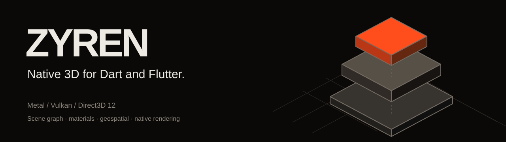

<p align="center">
  
</p>

<p align="center">
  <a href="https://xraph.com/work/zyren">Project</a> ·
  <a href="https://xraph.com/docs/zyren">Documentation</a> ·
  <a href="#quick-start">Quick start</a> ·
  <a href="#examples">Examples</a> ·
  <a href="https://github.com/xraph/zyren/issues">Issues</a>
</p>

# Zyren

Build your scene in Dart. Render it on the native GPU.

Zyren gives you a general-purpose 3D scene graph, native materials and lighting,
asset loading, camera controls and Flutter views. Rust and wgpu handle rendering
through Metal, Vulkan or Direct3D 12. You can use the Dart core on its own, add a
native renderer for headless work, or put a scene inside your Flutter interface.

Geospatial is optional. Add it when you need a globe, terrain, geographic
coordinates or an atmosphere. Your model viewer doesn't need to depend on it.

> **Alpha, under active development.** The packages currently use
> `publish_to: none`; run them from this workspace. APIs can change. Backend
> availability and device qualification are separate, so check the
> [platform table](#platforms) before choosing a presentation path.

## Quick start

You'll need [FVM](https://fvm.app), Rust through [rustup](https://rustup.rs), and
your platform's Flutter build tools. The workspace pins Flutter in
[.fvmrc](.fvmrc) and Rust in the [native toolchain file](packages/zyren_native/native/rust-toolchain.toml).

```sh
git clone https://github.com/xraph/zyren.git
cd zyren
fvm install
fvm flutter pub get
cd examples/multiple_views
fvm flutter run -d macos -t lib/native_scene_demo.dart
```

That example shares a Dart scene between two independently controlled native
views. Replace `macos` with your Android or iOS device ID. The native build hook
compiles and bundles Rust; the first build needs network access for toolchains.
On Apple hosts you'll need Xcode. Android builds also need the SDK and NDK.

For Windows or Linux, run `examples/planet/lib/main.dart` using `windows` or
`linux`. That example explicitly opts into RGBA readback while direct
presentation on those hosts remains unfinished.

### Your first scene

Inside a Flutter app in this workspace, depend on `flutter_zyren` using a path
to `packages/flutter_zyren`. You can copy this widget into your app:

```dart
import 'package:flutter/material.dart';
import 'package:flutter_zyren/flutter_zyren.dart';

class CubeView extends StatelessWidget {
  const CubeView({super.key});

  @override
  Widget build(BuildContext context) {
    return SizedBox(
      height: 320,
      child: SceneView.builder(
        runtime: const SceneRuntime.nativeMetal(),
        onCreate: (controller) {
          controller.scene.add(Mesh(
            BoxGeometry(),
            UnlitMaterial(color: Color3.hex(0x497ee8)),
          ));
        },
      ),
    );
  }
}
```

This uses Metal on macOS and iOS. Choose `SceneRuntime.nativeAndroid()` on
Android. Give the view bounded dimensions. The managed builder owns its scene
and controller; ordinary Flutter rebuilds retain them. See
[your first scene](https://xraph.com/docs/zyren/first-scene) for camera setup,
external controls and cleanup.

## What you can build

| Working area | What you get |
| --- | --- |
| Scenes and cameras | Hierarchies, transforms, perspective and orthographic cameras, orbit controls, camera-relative coordinates and CPU picking |
| Materials and lighting | Unlit, diffuse and metal/roughness materials; PNG/JPEG maps; alpha masks and blending; punctual and environment lights; directional and spot shadows |
| Native graphics | Shared geometry, instances, scoped GPU buffers and textures, WGSL compilation, compute/render graphs and custom mesh shaders |
| Screen effects | Linear HDR effects, exposure, tone mapping, bloom, FXAA, and MSAA where the adapter supports it |
| Model viewing | Static glTF/GLB loading with progress, cancellation, instancing and explicit unsupported-feature errors |
| Engineering tools | Selection, reversible transforms, measurements, section clipping, outlines, stable object IDs and review notes |
| Playback | Authored transform and camera tracks with play, pause and scrubbing |
| Geospatial | WGS84/ECEF coordinates, local east/north/up frames, globe controls, terrain, atmosphere and a bounded 3D Tiles streaming profile |
| Inspection | Scene hierarchy, transforms, reported capabilities and bounded frame history through `zyren_devtools` |

These are bounded implementations. Static glTF loading does not include skins,
morphs or imported animation. The renderer has a documented light, shadow and
resource budget. Full Three.js and three-geospatial parity remains a target.
Read the [renderer guide](https://xraph.com/docs/zyren/rendering) and
[asset limits](https://xraph.com/docs/zyren/assets) for the supported profiles.

## Packages

Start with `flutter_zyren` for Flutter, `zyren` for the Dart scene API, or
`zyren_native` for headless native output. Add the packages you need.

| Package | Purpose |
| --- | --- |
| [`zyren`](packages/zyren) | Pure Dart scene graph, geometry, materials, cameras, assets and plugin contracts |
| [`flutter_zyren`](packages/flutter_zyren) | Flutter views, controllers, input and native presentation |
| [`zyren_native`](packages/zyren_native) | Rust/wgpu renderer, FFI, build hooks, GPU resources and shader compilation |
| [`zyren_gltf`](packages/zyren_gltf) | Static glTF and GLB loading |
| [`zyren_geospatial`](packages/zyren_geospatial) | Geographic coordinates, globe navigation, terrain and atmosphere |
| [`zyren_3d_tiles`](packages/zyren_3d_tiles) | Bounded explicit, nested and implicit 3D Tiles streaming |
| [`zyren_tools`](packages/zyren_tools) | Selection, transforms, undo/redo and measurements |
| [`zyren_devtools`](packages/zyren_devtools) | Read-only scene inspection and reported frame statistics |
| [`zyren_timeline`](packages/zyren_timeline) | Transform and camera track playback |
| [`zyren_engineering`](packages/zyren_engineering) | Stable IDs, metadata, review notes and temporary isolation |

```text
Your Dart or Flutter application
  ├── flutter_zyren     views, input and controllers
  ├── optional plugins glTF, geospatial, tiles, tools, timeline, review
  └── zyren            scene graph and public extension contracts
        └── zyren_native adapter → Rust / wgpu → Metal | Vulkan | DX12
```

The diagram shows the rendering path. The core has no native or Flutter
dependency; you inject a renderer when creating a Dart-only engine. Plugins use
public core contracts. [Package boundaries](tool/check_package_boundaries.dart)
are checked in CI.

## Platforms

| Host | GPU backend | Flutter presentation | Qualification recorded in this checkout |
| --- | --- | --- | --- |
| macOS | Metal | Opt-in native view | Native renderer, presentation and interactive lab checks |
| iOS | Metal | Opt-in native view | iPhone 16 Pro renderer profile checks; coverage varies by feature |
| Android | Vulkan | Flutter surface texture, API 29+ | Pixel 9 Pro renderer and presentation checks; broader devices pending |
| Windows | Direct3D 12 | Explicit RGBA readback | Backend path exists; renderer profile not qualified on this host |
| Linux | Vulkan | Explicit RGBA readback | Backend path exists; renderer profile not qualified on this host |
| Web | None | None | Not supported |

WebGL, OpenGL and WebView rendering are disabled. Native presentation avoids
ordinary CPU pixel readback. Explicit capture/readback is a separate path with
copy overhead, and the Android surface runtime does not currently expose pixel
capture. Inspect runtime capabilities before requesting it.

You can read the [presentation guide](https://xraph.com/docs/zyren/platforms)
for policies and platform limits. This table summarizes repository evidence;
it does not claim every feature has been exercised on every device.

## Examples

Run the target from its directory after resolving workspace dependencies.
Use a connected device ID in place of `macos` for the native mobile labs.

| Example directory | Target | Try it |
| --- | --- | --- |
| [`examples/multiple_views`](examples/multiple_views) | `lib/native_scene_demo.dart` | Two native views, one scene, independent cameras |
| [`examples/multiple_views`](examples/multiple_views) | `lib/scene_workbench.dart` | Select, transform, undo, measure, review and scrub an assembly |
| [`examples/model_viewer`](examples/model_viewer) | `lib/main.dart` | Load static glTF/GLB models and inspect loader issues |
| [`examples/shader_lab`](examples/shader_lab) | `lib/main.dart` | Custom shaders and shared rendering resources |
| [`examples/planet`](examples/planet) | `lib/renderer_lab.dart` | PBR, shadows, instances and screen effects |
| [`examples/planet`](examples/planet) | `lib/atmosphere_lab.dart` | Day, dusk, night, haze and orbital views |
| [`examples/planet`](examples/planet) | `lib/navigation_lab.dart` | Native globe navigation |
| [`examples/planet`](examples/planet) | `lib/tiles3d_lab.dart` | Nested tiles, simulated download failure and retry |

```sh
cd examples/planet
fvm flutter run -d macos -t lib/tiles3d_lab.dart
```

The tiles fixture serves local sample data over loopback HTTP. You can exercise
refinement and recovery without provider credentials. Your own remote sources
need a resolver, credentials where required, and suitable attribution.

## Coordinates, color and ownership

- Scene positions use doubles until the camera origin is subtracted. Local vertex
  attributes use float32 storage. Generic 3D cameras use Y up; ECEF uses Z up.
- `Geodetic.degrees(longitude, latitude, height)` takes longitude first. Heights
  and ECEF coordinates are metres. The ordinary `Geodetic` constructor uses radians.
- Colors are linear RGB. `Color3.hex` converts an sRGB hex value for you.
- Managed views own their controllers. If you pass an external controller,
  dispose it yourself. Only one frame may be in flight per view.
- Geometry can be shared. Removing the last owning view retires its resources
  after submitted GPU work finishes; hiding a mesh retains its allocation.

## Documentation

The public guides live at [xraph.com/docs/zyren](https://xraph.com/docs/zyren).
You can start with [installation](https://xraph.com/docs/zyren/installation),
[scenes](https://xraph.com/docs/zyren/first-scene),
[plugins](https://xraph.com/docs/zyren/plugins), or
[geospatial](https://xraph.com/docs/zyren/geospatial).

Local docs sources follow the same `docs/content/docs` MDX layout as Forge.
The root `docs/` directory is intentionally Git-ignored. Public copies are
imported and committed in `xraph/website`:

```sh
# From your xraph/website checkout:
pnpm docs:import /path/to/zyren zyren v0
pnpm docs:build
```

The website owns the committed documentation snapshot, navigation, search and
version routes. The local source tree is not included in a fresh Zyren clone.
See [contributing documentation](https://xraph.com/docs/zyren/contributing)
for the import and recovery workflow.

## Development checks

```sh
fvm flutter analyze
fvm dart run tool/check_package_boundaries.dart
cargo test --manifest-path packages/zyren_native/native/Cargo.toml --locked
cargo clippy --manifest-path packages/zyren_native/native/Cargo.toml --all-targets --locked -- -D warnings
(cd packages/zyren && fvm dart test)
(cd packages/zyren_gltf && fvm dart test)
fvm flutter test packages/flutter_zyren/test examples/multiple_views/test
```

GPU checks need a compatible native device:

```sh
cd packages/zyren_native
RUN_NATIVE_GPU=1 fvm dart test --concurrency=1
```

A missing GPU fails a GPU check. Run the affected example on your target device
as well as its automated tests, and include that device, backend and any remaining
limits when reporting a result. [Native checks](.github/workflows/checks.yml)
contains the full CI commands.

## Third-party notices

Zyren includes ports and dependencies with their own license requirements.
Read [THIRD_PARTY_NOTICES.md](THIRD_PARTY_NOTICES.md) and the
[license texts](licenses/) before redistributing those components.
