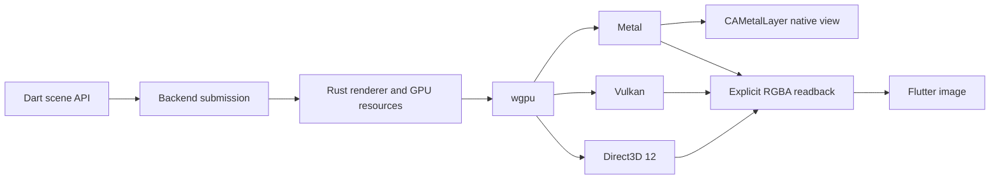

# Zyren architecture

You build scenes in Dart. Rust owns GPU resources and submits work directly to
Metal, Vulkan or Direct3D 12 through wgpu. There is no WebView, JavaScript runtime,
WebGL backend or OpenGL fallback.

## Package boundaries

- `zyren`: Dart scene graph, geometry, engine, plugins and backend contracts.
  It has no Flutter, native backend or geospatial dependency.
- `zyren_native`: Rust renderer, worker isolate, FFI bindings and build hook.
  It depends on `zyren` and runs without a Flutter engine.
- `flutter_zyren`: Flutter viewport and presentation, plus a compatibility
  engine facade that supplies the native renderer by default.
- `zyren_geospatial`: an optional `ScenePlugin` package with geodetic
  coordinates, ellipsoids, local frames, globe geometry and orbit controls.
  Geospatial features must use public core extension points.
- `examples/planet`: a runnable native Flutter application.

Keep the geospatial package optional. A model viewer should not need an Earth
model, and a coordinate conversion should not need to initialize a GPU.

## Extension boundaries

`SceneEngine` resolves plugin dependencies, checks renderer capabilities and owns
initialization, frame hooks and teardown. Plugins exchange typed services within
one engine. There is no global service registry. A failed attach rolls back even
partially initialized plugins, and cleanup continues after a detach error.

`SceneRenderer` defines native rendering independently of Flutter widgets.
`FramePresenter` handles the RGBA-to-widget conversion, and `PresentedFrame` owns
resources for one displayed result. `SceneView` accepts factories for both. It
serializes configuration changes with pending work and discards stale frames.

The native implementation still has one opaque mesh pipeline. Dart plugins can
manage scenes, controls and services today. Native shader registration, render
passes, texture resources and loader contracts remain core milestones. See the
[extension guide](extensions.md) for the implemented contracts.

The advanced `RenderBackend` contract takes an immutable `FrameSubmission` and
returns `FrameOutput`. The default `NativeBackend` advertises readback only.
`SceneRuntime.nativeMetal()` supplies a controller-owned renderer and a hosted
presenter that mounts an AppKitView or UiKitView before preparing its target.
Each attachment has a generation; resize, suspension and removal revoke old
frame receipts. Rendering and capture share the renderer's geometry cache.
The legacy
`SceneRenderer`/`RenderedFrame` path remains an explicit readback compatibility
API. `SceneEngine.renderFrame` and the Flutter controller preserve `FrameOutput`
through plugin hooks and presentation. Platform presenters prepare their own
output targets and own registration for one view attachment.

## Renderer

The first renderer uses indexed triangle meshes, a depth buffer, perspective
cameras, scene transforms, opaque materials and directional diffuse lighting.
Geometry is uploaded once per native device and shared between meshes and
explicit shared readback views. Rust validates
the scene before changing GPU state. Invalid handles and malformed requests return
errors through the C ABI.

Dart keeps the scene graph. It composes transforms in double precision, subtracts
the camera position before converting matrices to float32, and sends one scene
snapshot per frame. Rust owns its device, pipelines, buffers and render targets.
The readback bridge runs in a persistent Dart isolate. The Metal view adapter
uses a serial native queue and async channel replies so GPU waits cannot block
Flutter's UI isolate or the platform thread. Each viewport allows one frame in flight.

The initial presentation path reads native GPU pixels into an RGBA buffer and
uploads that buffer into a Flutter image. This is real native GPU rendering, but
the extra copy limits throughput. The opt-in Apple runtime renders directly into
Metal drawables and publishes after the core engine's render hooks complete.
Ordinary frames carry receipts and statistics through Dart, with no pixel
readback. Explicit capture still returns pixels. The earlier IOSurface Flutter
texture experiment remains gated because of compositor cache retention.
SurfaceProducer on Android and shared D3D textures on Windows remain separate
presentation milestones.

## Build integration

Use Dart build hooks and `native_toolchain_rust` to compile and bundle the Rust
library. Flutter 3.38 introduced the recommended native asset workflow; this
repository pins Flutter 3.47.5 for development without changing your global SDK.
Cargo dependencies and Dart package resolutions are checked in.

Only native targets are supported. Metal is enabled for macOS/iOS, Vulkan for
Android/Linux and DX12 for Windows. A missing compatible device is an error.

## Geospatial conventions

Geodetic angles are radians. Heights and Earth-centered Earth-fixed (ECEF)
coordinates are metres. ECEF is right handed: X crosses longitude zero, Y crosses
90 degrees east, Z points north. Local frames use east, north, up. The ordinary
scene API is right handed with Y up by default; the globe example uses Z up.

Keep absolute world positions in double precision. Camera-relative rendering
preserves local detail at Earth scale. Opt-in `DepthStrategy.reversed` keeps
perspective depth precision across large near/far ratios on supporting backends.
The [measured depth fixture](parity/planetary-depth.md) separates depth
quantization from GPU occlusion evidence and records the remaining limits.

## Why this stack

wgpu provides the native backend portability we need while Rust handles GPU
resource ownership. Dart stays responsible for the public API and Flutter
lifecycle. A small versioned C ABI keeps the boundary independent of a bridge
generator. Binary scene packets carry typed geometry and changed mesh records.
The v1 JSON adapter remains for existing native callers.

Three.js provides an API reference, not a runtime dependency. We are not promising
source compatibility with its materials, loaders, shaders or extensions.

Sources: [wgpu](https://github.com/gfx-rs/wgpu),
[Flutter native code](https://docs.flutter.dev/platform-integration/bind-native-code),
[native_toolchain_rust](https://pub.dev/packages/native_toolchain_rust).
