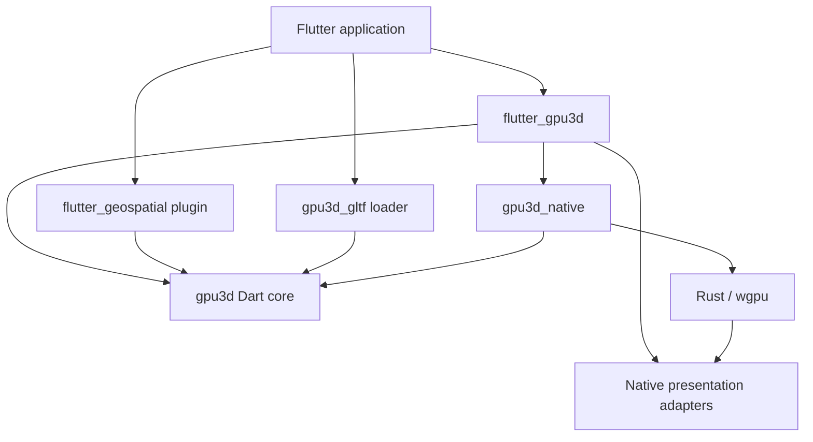

# Native Dart 3D API design

Status: proposed API for the next releases. This document specifies work to build.
Only the API described in [extensions](../extensions.md) exists today. Examples
below are design examples and do not compile against version 0.1.0.

Start with the [implementation program](../superpowers/plans/2026-09-26-native-3d-program.md)
for delivery order and tests. The examples here show the target API after their
owning milestones land; the first milestone uses `UnlitMaterial` until PBR exists.

The public API should let you create a useful scene before you need to understand
GPU queues, resource handles or Flutter texture registration. Those details still
need precise contracts. They belong behind the normal scene API and in a separate
advanced import.

## 1. Project requirements

- Render 3D through native Metal, Vulkan or Direct3D 12. Do not add WebGL, a WebView, JavaScript or an OpenGL renderer fallback.
- Keep geospatial an optional plugin. The general 3D core must never import geospatial.
- Target general 3D capabilities comparable to Three.js; do not claim JavaScript source compatibility or current feature parity.
- Keep scene data, geometry, materials, animation and plugin contracts usable from Dart without Flutter widgets.
- Use Flutter 3.47.5 and Rust 1.97.1 for development; keep Dart SDK >=3.10.0 <4.0.0 and Flutter >=3.38.0 declarations until a tested API requires a higher floor.
- Keep wgpu pinned to 30.0.1 while introducing native texture interoperability; review unsafe HAL code before changing that pin.
- Commit each verified task locally. Do not push or merge without a request.
- Keep shipped prose free of em dashes and attribution trailers.

Minimum OS and GPU support are qualification results, not inferred from these SDK
floors. The release matrix must list tested OS versions, architectures, adapters
and required GPU features. No platform becomes supported just because it builds.

## 2. Package layout

| Package | Responsibility | Dependencies inside this repository |
| --- | --- | --- |
| `gpu3d` | Dart scene model, maths, resource descriptions, engine contracts, plugins, animation and render graph | None |
| `gpu3d_native` | Rust renderer, versioned FFI, native resource registry, worker and offscreen rendering | `gpu3d` |
| `flutter_gpu3d` | Public Flutter facade, controller, viewport, input adapter and native presentation registration | `gpu3d`, `gpu3d_native` |
| `flutter_geospatial` | Geodetic maths, world model, globe/terrain/atmosphere plugins | `gpu3d` |
| `gpu3d_gltf` | Optional glTF decoder and asset request types | `gpu3d` |
| `gpu3d_inspector` | Optional Flutter diagnostics and scene inspection tools | `flutter_gpu3d` |

Keep the current public Flutter package names. New package names are working
repository names; check registry availability before publication. Re-export the
common core types from `flutter_gpu3d.dart`, so Flutter applications need one
import for ordinary 3D work. Use `gpu3d.dart` for Dart-only work and
`rendering.dart` for advanced graph/shader contracts. Avoid barrel exports of FFI
bindings, platform pointers and generated implementation code.

Keep Apple, Android, Windows and Linux presentation adapters in platform folders
of `flutter_gpu3d` initially. Separate federated packages only when they need
independent releases or maintainers. Move the existing Rust crate intact to
`gpu3d_native/native`; do not combine that move with a renderer rewrite.



## 3. The default Flutter workflow

The managed constructor creates one controller per mounted viewport. Flutter
rebuilds update widget configuration without reconstructing the scene. `onCreate`
runs once; changing `sceneKey` closes the previous scene before creating another.
Inside your existing Flutter app, add one 3D import. The host's normal Flutter
imports supply `Widget`, `BuildContext` and its loading/error widgets.

```dart
import 'package:flutter_gpu3d/flutter_gpu3d.dart' as g;

Widget build(BuildContext context) => g.SceneView.builder(
  sceneKey: const ValueKey('preview'),
  onCreate: (view) {
    final cube = view.scene.add(
      g.Mesh(
        g.BoxGeometry(),
        g.StandardMaterial(baseColor: g.Color3.hex(0x48bdb2)),
        name: 'Preview cube',
      ),
    );
    view.camera = g.PerspectiveCamera(
      position: const g.Vec3(3, 2, 5),
      target: g.Vec3.zero,
    );
    view.use(g.OrbitControls());
    view.onUpdate((frame) => cube.rotateY(frame.deltaSeconds));
  },
  loadingBuilder: (_) => const CircularProgressIndicator(),
  errorBuilder: (_, issue, retry) => ErrorPanel(issue: issue, onRetry: retry),
);
```

`ErrorPanel` is an application widget supplied by this example's host, not a core
type. The shipped example implements it using the host's shared empty/error
state. Every other `g` symbol above is part of the target API inventory below.

For access from other controls, create a controller in `State.initState`, pass it
to `SceneView(controller: controller)`, and dispose it from `State.dispose`.
That constructor borrows the controller. It does not dispose it on unmount.

```dart
late final g.SceneController view;

@override
void initState() {
  super.initState();
  view = g.SceneController(
    scene: g.Scene(),
    camera: g.PerspectiveCamera(position: const g.Vec3(3, 2, 5)),
    options: const g.EngineOptions(renderMode: g.RenderMode.onDemand),
  );
}

void moveSelection(g.Object3D object) {
  view.update(() => object.position = const g.Vec3(1, 0, 0));
}

@override
void dispose() {
  view.dispose();
  super.dispose();
}
```

`dispose()` synchronously rejects new work, removes Flutter listeners and starts
native cleanup. Tests, CLI tools and route coordinators can await
`view.whenDisposed`. Normal Flutter `dispose()` methods do not need to be async.
A disposed controller cannot be mounted again. Detaching a borrowed controller
releases the presentation surface but retains its CPU scene and scoped assets;
its native session may idle until remount or explicit disposal.

One controller can drive one mounted viewport at a time. A second attachment
fails with `controllerAlreadyAttached` and names both views. Use separate
controllers to display one scene with different cameras. Both read snapshots on
the same Dart isolate; they never mutate a shared camera implicitly.

## 4. Public contract inventory

These signatures are the naming contract for implementation plans. They are
interface notation; fields shown on value types are constructor parameters.

```dart
enum RenderMode { onDemand, continuous }
enum PresentationPolicy { requireNative, requireSharedTexture, allowReadback, readbackOnly }
enum RecoveryPolicy { manual, automaticOnce }

class EngineOptions {
  const EngineOptions({
    RenderMode renderMode = RenderMode.onDemand,
    PresentationPolicy presentation = PresentationPolicy.requireNative,
    RecoveryPolicy recovery = RecoveryPolicy.manual,
    int maxFramesPerSecond = 60,
    int maxFramesInFlight = 2,
  });
}

class SceneController {
  SceneController({Scene? scene, Camera? camera,
    EngineOptions options = const EngineOptions(), SceneRuntime? runtime});
  Scene get scene;
  Camera get camera;
  set camera(Camera value);
  AssetScope get assets;
  ValueListenable<SceneStatus> get status;
  Stream<SceneIssue> get issues;
  Stream<FrameStats> get frameStats;
  Future<RendererInfo> get ready;
  Future<FrameStats> get firstFrame;
  Future<void> get whenDisposed;
  bool get isDisposed;
  void update(void Function() changes);
  void invalidate();
  void invalidateHistory();
  Registration onUpdate(void Function(FrameTime) callback);
  T use<T extends ScenePlugin>(T plugin);
  Future<PickResult?> pick(ViewportPoint point);
  Future<ImageData> capture({CaptureOptions options = const CaptureOptions()});
  Future<void> retry();
  void dispose();
}

class SceneView extends StatefulWidget {
  const SceneView({Key? key, required SceneController controller,
    SceneLoadingBuilder? loadingBuilder, SceneErrorBuilder? errorBuilder,
    double resolutionScale = 1, ScenePointerCallback? onPointer});
  const SceneView.builder({Key? key, Object? sceneKey,
    required void Function(SceneController) onCreate,
    EngineOptions options = const EngineOptions(),
    SceneRuntime? runtime,
    SceneLoadingBuilder? loadingBuilder, SceneErrorBuilder? errorBuilder,
    double resolutionScale = 1, ScenePointerCallback? onPointer});
  const SceneView.scene({Key? key, required Scene scene, required Camera camera,
    List<ScenePlugin> plugins = const []});
}
```

`SceneLoadingBuilder` is `Widget Function(BuildContext)`.
`SceneErrorBuilder` is `Widget Function(BuildContext, SceneIssue, VoidCallback)`.
`ScenePointerCallback` is `void Function(ScenePointerEvent)`.
`SceneView.scene` is the migration bridge for the current convenience constructor.
It uses the managed ownership model. Its implementation must not duplicate the
controller, input or presentation state machines.

`SceneRuntime` is an optional advanced configuration for backend creation and
`AssetServices`. Its `backendFactory` is `Future<RenderBackend> Function()`;
`assetServices` supplies a `ByteSourceResolver` and `ImageDecoder`. The Flutter
facade provides native/bundle defaults. Hosts can substitute a deterministic test
backend or authenticated resolver without subclassing the viewport. Export the
advanced backend contracts through `rendering.dart`; FFI remains private.

The implemented Apple opt-in is `const SceneRuntime.nativeMetal()`. Its platform
view reports `PresentationPath.nativeView`; it never claims to be a shared
Flutter texture. `requireNative` accepts either qualified native presentation
path, while `requireSharedTexture` rejects platform views. The default runtime
does not yet choose the Metal view automatically.

Android API 29 or newer has an explicit `const SceneRuntime.nativeAndroid()`.
It reports `PresentationPath.sharedTexture` and supports `requireNative` and
`requireSharedTexture`. Each controller owns a Vulkan renderer. Each view
attachment owns a Flutter SurfaceProducer, released on detach while the renderer
and uploaded geometry survive a borrowed controller's remount. Stale attachment
IDs and epochs cannot publish into the next view. This runtime does not advertise
RGBA capture. Default runtime selection and broader Android qualification remain
open.

Construction creates CPU state with `SceneDetached` status. First attachment
starts the backend after plugin composition is complete. Creating a controller
in `initState` therefore does not allocate a GPU before it has a view. Asset CPU
services can run before attachment. Offscreen applications use `SceneEngine`
with an explicit backend and readback target, without a Flutter controller.

`ready` completes when the renderer and plugins are ready, not when the user has
seen a frame. `firstFrame` completes when a frame is ready for the compositor.
Physical display latency requires native tracing. Ready futures fail if disposal
wins initialization; retry creates a new readiness generation and status reports
its generation. Code holding the failed generation's future still sees failure.
Readiness is per engine generation; a borrowed view remount can retain that
generation while acquiring a new surface epoch. Use status/presentation events
for subsequent attachments, rather than awaiting the original `firstFrame` again.
Disposal errors complete `whenDisposed` with a typed cleanup failure and report
any native ownership still awaiting safe retirement; they never hang a Dart
future indefinitely or free a buffer still in use.

Defaults are useful immediately: an empty scene, perspective camera at `(0,0,5)`,
Y up, linear lighting, sRGB output, transparent canvas and viewport-driven aspect.
The geospatial plugin sets its own world convention. It cannot change global
maths or coordinate defaults.

`resolutionScale` multiplies the viewport's physical pixel dimensions. Flutter
logical points, device pixel ratio and this multiplier are distinct. Clamp against
negotiated device limits and expose the effective size in `FrameStats`; do not
silently distort aspect ratio.

`SceneStatus` is a sealed hierarchy: `SceneDetached`, `SceneInitializing`, `SceneReady`,
`SceneSuspended`, `SceneRecovering`, `SceneFailed`, `SceneDisposed`. Every state has
`generation`; ready also has `RendererInfo`, failed has `SceneIssue`. The status
listenable changes on lifecycle transitions, not each frame. Frame statistics use
a broadcast `frameStats` diagnostic stream, sampled at most five times per second
by default, so 60 FPS does not cause 60 widget rebuilds. Plugins receive each
frame's statistics through their lifecycle hook when that detail is required.

`RendererInfo` contains backend, adapter name, driver description when available,
capabilities, selected presentation path and supported sample counts.
`CaptureOptions` specifies physical size, color space and whether alpha is kept.
`capture()` is an explicit readback operation and never runs as part of ordinary
shared-texture presentation.

## 5. Scene objects and predictable updates

Keep `Scene`, `Object3D`, `Mesh`, `BoxGeometry`, `SphereGeometry`,
`PerspectiveCamera` and `Color3`. Add `Camera`, `OrthographicCamera`, `Group`,
`InstancedMesh`, `LineSegments`, `Points`, `Bounds3`, `Ray` and `Raycaster`.
`Scene.add<T extends Object3D>(T child)` returns that child. Reparenting preserves
one parent and rejects cycles. `remove` detaches without destroying shared assets.

Adopt immutable double-precision `Vec3`, `Quat` and `Mat4` as scene-facing values.
Property setters copy/validate input and increment revisions. This makes
`object.position = const Vec3(1, 2, 3)` observable. The existing mutable
`vector_math` values remain implementation tools and explicit interop conversions;
they must not expose writable storage that bypasses scene invalidation.

Convenience methods `translate(Vec3)`, `rotateX(double)`, `rotateY(double)`,
`rotateZ(double)` and `lookAt(Vec3)` update revisions and return the object.
Angles are radians; `Angle.degrees(double)` returns radians. Geodetic APIs keep
an explicit degrees constructor. Matrices use column-major storage and right
handed coordinates; native depth is normalized to `[0,1]` by the backend.

```dart
final bolt = scene.add(Mesh(geometry, material, name: 'Bolt M12'));
bolt.position = const Vec3(2, 1, 0);
bolt.rotateY(Angle.degrees(90));
bolt.visible = false;
```

Use immutable material descriptions. `mesh.material = material.copyWith(...)`
invalidates its bindings. Geometry has immutable layouts with explicit
`updateAttribute(VertexSemantic, TypedData, {int firstVertex = 0})` for dynamic
buffers. Mutations validate counts/ranges and enqueue dirty byte ranges.
Static and dynamic geometry can be shared. Captures retain immutable revisions,
and native buffers reuse exclusive storage or preserve versions held by another
view. No scene mutation calls FFI immediately. See
[dynamic geometry](gpu-resources.md#dynamic-geometry) for current formats and
range-upload behavior.

An outermost `controller.update` batches notifications into one invalidation.
It does not roll back Dart changes if the callback throws; it publishes the final
revision in `finally` and rethrows. Nested updates use the same batch. Individual
property setters also invalidate, so the batch is an optimization, not a
correctness requirement.

On-demand rendering wakes for scene revisions, camera movement, resize, loaded
assets, animation or plugin invalidation. `onUpdate` installs a continuous frame
demand until its returned `Registration.dispose()` is called. Active animations
and damping controls acquire the same demand and release it when settled.
Hidden views stop submissions. Visible unfocused views continue rendering.

`FrameTime` has monotonic `elapsed`, bounded `delta`, unbounded `rawDelta` and
`index`, plus `elapsedSeconds` and `deltaSeconds` convenience getters. Resume
starts with zero delta. Fixed-step simulation is an optional
clock consumer, not a global timing rule for every scene.

## 6. Resource ownership

| Object | Owner and release rule |
| --- | --- |
| CPU scene, geometry/material descriptions | Dart references; removing a mesh does not invalidate shared descriptions |
| GPU buffers, pipelines and textures | Native renderer cache with scope references, budgets and submission-fence retirement |
| Managed controller | `SceneView.builder`; teardown also cancels its asset work |
| Borrowed controller | Application; `dispose()` is required |
| Loaded model/template | `AssetScope`; instantiated nodes keep references to shared decoded resources |
| Plugin registrations, scratch resources and subscriptions | Plugin attachment scope; rollback and detach release them automatically |
| Presentation surfaces and frame leases | View attachment; native consumer release and GPU completion govern recycling |

A geometry constructor creates a CPU description. The renderer uploads it lazily
and reuses its resource ID. You do not call `dispose()` on every box or mesh.
GPU eviction follows live references, budgets and in-flight submissions, not
visibility alone. Asset scopes hold loaded resources deliberately; removing an
object from the scene does not cancel an unrelated loader or evict another view's
texture. Explain retained memory through diagnostics.

Advanced plugins use `ResourceScope` and `GpuResource<T>` handles. Handles contain
a renderer/device identity, slot and generation internally. A handle from another
renderer, a previous device generation or a closed scope fails validation before
submission. Dart never receives a raw Metal, Vulkan or Direct3D pointer.

`ResourceScope.close()` prevents new allocation and waits for its references to
retire. Native finalizers remain a fallback for isolate teardown. They are not
the primary release mechanism. Native callbacks may arrive after widget removal;
they retain only the native lease they need, not a Dart object or widget.

## 7. Assets, loading and cancellation

The [typed loading infrastructure](asset-loading.md) is implemented. The glTF
request and model APIs below remain the Task 3 target until its decoder and
viewer fixtures pass.

```dart
import 'package:gpu3d_gltf/gpu3d_gltf.dart';

final task = view.assets.load(Gltf.asset('assets/pump.glb'));
final subscription = task.progress.listen(showLoadProgress);
try {
  final model = await task.result;
  view.scene.add(model.instantiate(name: 'Pump P-101'));
} on LoadCancelled {
  // The view was removed or the caller cancelled this task.
} on AssetLoadException catch (error) {
  showAssetError(error);
} finally {
  await subscription.cancel();
}
```

The host supplies `showLoadProgress` and `showAssetError`. No widget `mounted`
check is needed to protect the managed scene: disposal cancels outstanding tasks,
settles their result with `LoadCancelled` and discards late results. Application
callbacks that update Flutter widgets still follow Flutter's mounted rules.

Canonical types:

- `AssetScope.load<T>(AssetRequest<T> request) -> LoadTask<T>`.
- `LoadTask<T>.result -> Future<T>`, `progress -> Stream<LoadProgress>`,
  `cancel() -> void`. Cancellation is idempotent and wins until successful result
  delivery. Progress closes after success, cancellation or failure.
- `LoadProgress`: stage (`fetch`, `decode`, `prepare`), completed bytes and optional
  total bytes. Unknown totals do not produce invented percentages.
- `Gltf.asset(String)` / `Gltf.uri(Uri)` return `AssetRequest<ModelAsset>`.
- `ModelAsset.instantiate({String? name}) -> Object3D`; instances have independent
  transforms and animation state, shared immutable geometry/textures.
- `AssetScope.release(Object asset) -> void` drops the scope's hold. Existing
  instances retain what they use; released templates cannot create more instances.

`AssetLoader<T>` declares accepted request type, decode and cancellation handling.
A typed request carries its loader, so `Gltf.asset` needs no separate registration
call. `AssetDecodeContext` supplies cancellation, byte budgets, source resolution
and image decoding. `SceneRuntime.assetServices` lets the host override those
services; optional loaders still import only `gpu3d`.
`ByteSourceResolver` supplies bundle, file, memory or HTTP bytes with size limits.
The Flutter adapter provides bundle access. Network credentials stay in the host
resolver. External glTF references follow the request's base URI and resolver
policy; bundle requests cannot escape into arbitrary filesystem paths.

Cache identity includes source URI, content/version identity and decode options.
Two consumers can share one decode job while retaining independent cancellation.
Cancel the underlying job only after its last consumer leaves. Decoders reject
out-of-range accessors, unsupported required extensions and over-budget resources
with the source and offending field path. Optional unsupported features produce
a structured issue; they do not silently change required material semantics.
Each consumer receives its own scope-owned template wrapper over shared immutable
decoded data. Releasing one wrapper cannot invalidate another scope's template.
Cancellation does not revoke results already delivered. If application code waits
on unrelated work after a successful load, check `view.isDisposed` before using
that controller again. Instantiation from a released template fails explicitly.

## 8. Materials, lights and asset compatibility

The [standard material profile](standard-materials.md) implements base color,
normal, metallic/roughness, occlusion and emissive maps, shared raster settings,
and explicit or derivative tangent bases. Directional, point, spot and hemisphere
lights are scene objects. The [color pipeline](color-pipeline.md) adds linear
RGBA16Float scene/effect color with terminal exposure and tone mapping. You can
load [HDR assets](hdr-assets.md) through CPU asset scopes and upload their linear
float pixels. Environment reflections and shadow APIs remain targets.

The common path is `StandardMaterial`: linear `baseColor`, optional base-color,
normal, metallic/roughness, occlusion and emissive textures; metallic, roughness,
emissive intensity, alpha mode, cutoff, sidedness and depth settings. Also provide
`UnlitMaterial`, `LineMaterial`, `PointsMaterial` and advanced `ShaderMaterial`.
The [custom mesh material checkpoint](shader-materials.md) implements
`ShaderMaterial` through `ShaderCompiler.compileMesh`, with device ownership,
read-only bindings and native raster-state variants.
The current `MeshMaterial` migrates to `DiffuseMaterial` or `UnlitMaterial`.

Texture descriptions declare dimension, format, color space, usage, mip levels
and sampler. Base color/emissive images are sRGB by default; normals and scalar
maps are linear. Internal lighting is linear, HDR passes use negotiated floating
formats, and output conversion happens once. Explicit alpha modes are opaque,
mask and blend. Adopt premultiplied alpha only at the compositor boundary; shader
material inputs retain documented straight-alpha semantics.

Support directional, point, spot and hemisphere lights, then area lighting where
the chosen shading model supports it. Shadows, image-based lighting and physically
based materials need numerical and rendered fixtures. Use glTF reference scenes
as a compatibility gate. List supported extensions by exact name and fixture;
never advertise glTF support solely because one model loads.

## 9. Plugins and native rendering extensions

Preserve the current `ScenePlugin` ID, dependency graph and typed `ServiceKey<T>`
model. Add attachment-scoped resource and registration ownership, structured
capabilities, input and graph extension access. Keep registration during attach.
A plugin may assemble meshes using ordinary public APIs without requiring a
custom native pass.

```dart
class HeatmapPlugin extends ScenePlugin {
  @override
  String get id => 'example.heatmap';

  @override
  Set<RenderFeature> get requiredFeatures => {
    RenderFeature.compute,
    RenderFeature.storageTextures,
  };

  @override
  Future<void> attach(PluginContext context) async {
    final program = await context.shaders.compile(
      ShaderSource.wgsl(heatmapWgsl, label: 'Heatmap'),
    );
    context.scope.keep(context.graph.addCompute(
      ComputePassDescriptor(
        name: 'heatmap.update',
        program: program,
        workgroups: const Workgroups(32, 32, 1),
        bindings: heatmapBindings,
        reads: const [],
        writes: [heatmapTexture],
      ),
    ));
  }
}
```

`context.shaders`, `ShaderSource` and `ShaderProgram` are implemented in the
[compiler checkpoint](shader-compilation.md). `context.resources` now owns GPU
allocations and `context.graphs` owns a graph compiler for explicit execution;
see [render graphs](render-graphs.md). `context.graph` inserts shared compute,
render and effect contributions into the scene frame. Its registrations belong
to the attachment automatically; the explicit `scope.keep` above is optional.
Compute and render contributions default to preparation before the scene.
Use `addEffect` for a color chain with automatic resize and candidate cleanup.
Manual composition is available through an attachment-owned
`context.frameGraph` binding. It selects a compiled graph whose `sceneColor` and
`output` textures connect the scene to native presentation. Choose shared or
manual composition for each view. Mixing them is rejected during attachment.
`heatmapWgsl`, `heatmapBindings` and
`heatmapTexture` will be application inputs in the independent effects example.
`ShaderSource`,
`ComputePassDescriptor`, `Workgroups` and `ShaderBindings` are advanced core
contracts. A shader program comes from compilation; callers cannot fabricate one
by casting an integer. `context.scope.keep(Registration)` guarantees deregistration
before scope resources retire.
The context's shader compiler is attachment-scoped, so compiled programs retire
with that scope even if later graph registration fails.

`RenderFeature` is a typed enum for portable capabilities such as storage textures,
compute, indirect draws and timestamp queries. `DeviceCapabilities.supports` and
`limits` describe the selected device, not all possible wgpu backends. A plugin
must explicitly choose a fallback implementation or reject unsupported features.
Native backend adapters may use namespaced extension keys internally; the portable
plugin API does not branch on OS strings.

A render graph records passes, resource reads/writes, load/store operations,
formats, sample counts and explicit dependencies. Compilation validates cycles,
read-before-write, incompatible aliases and resource budgets. The executor derives
hazards from those declarations. Plugin order alone does not synchronize GPU work.
Shared effects allocate persistent history through `frame.createHistory()`.
Resize, camera replacement, projection changes and engine recreation reset its
validity. Call `controller.invalidateHistory()` or
`context.graph.invalidateHistory()` after a camera cut. History belongs to a view;
see [texture history](texture-history.md) for shader bindings and failure behavior.

Custom `Camera` subclasses must implement `projectionMatrix(aspect)` as well as
`viewProjection(aspect)`. The projection matrix excludes camera position and
orientation. `CameraSnapshot.projection` freezes it with the scene and combined
view-projection matrix before asynchronous preparation, so camera motion can
preserve history while a projection change resets it. This adds a required method
to the unpublished camera API.

WGSL is the first custom shader language. Compile through the native toolchain,
return labeled source locations and binding-layout errors, and cache by source,
options and device features. Do not build a shader DSL before real material and
postprocessing examples establish what it needs. The geospatial atmosphere and
cloud plugins must use these same public graph and shader contracts.

Plugin composition freezes when initialization starts. `view.use(plugin)` is
allowed during construction or managed `onCreate`. Installing/removing plugins
on a live session is excluded from 0.2; recreate the managed scene with a new
`sceneKey`. This keeps frame execution and teardown predictable. Scene contents,
assets, materials and camera settings remain mutable while running.

## 10. Input, picking, animation and Flutter composition

Use `ScenePointerEvent` with logical `ViewportPoint(x,y)`, pointer identity,
buttons, kind, modifiers and phase. `SceneView` converts Flutter events and
participates in the gesture arena. `OrbitControls` requests gestures through that
adapter; it does not intercept global input or clicks on overlay buttons.

`pick(ViewportPoint)` returns the nearest visible/layer-matching `PickResult?`:
object, world point, distance, triangle/instance index and optional UV. Snapshot
the camera and view size for the request. Map logical points to normalized device
coordinates once. Begin with CPU bounds and triangle tests; add acceleration
structures without changing this public result.
Include `sceneRevision` in the result so a tool can identify a pick completed
against an earlier scene snapshot. `ViewportPoint.toNdc` takes logical width and
height and returns `Vec3(x,y,0)`; physical resolution never enters that conversion.

`AnimationClip`, typed tracks, interpolation, `AnimationMixer` and `Action` form
the animation API. `mixer.play(clip)` returns an action with pause, seek, speed,
weight, loop and stop. Mixers own frame demand while actions run. Skin and morph
updates use typed geometry resources and must work on native mobile feature limits.

Texture presentation must compose with Flutter clipping, transforms, opacity,
scrolling, overlays and hit testing. Flutter rebuilds do not recreate the GPU.
Hot reload retains the controller/scene; changing setup code requires explicit
retry/recreate or hot restart. A hot restart cannot rely on Dart `dispose()`:
native engine detach, port closure and finalizer paths must release resources.

## 11. Error and diagnostic contract

`SceneIssue` has stable `code`, `severity`, readable message, `operation`, optional
resource label, plugin ID, source URI, shader line/column, backend and native cause.
Do not require applications to match English error strings.
Codes are stable strings exposed through named constants. `SceneException`
contains the issue for asynchronous operational failures; asset-specific
exceptions retain that structured context.

Initial codes: `backendUnavailable`, `presentationUnavailable`,
`unsupportedFeature`, `invalidGeometry`, `invalidShader`, `resourceBudgetExceeded`,
`staleResource`, `controllerAlreadyAttached`, `pluginDependencyMissing`,
`pluginDependencyCycle`, `assetDecodeFailed`, `loadCancelled`, `deviceLost` and
`disposed`. Synchronous caller mistakes throw `ArgumentError`/`StateError` with
context. Operational failures use typed exceptions and the issue stream; failure
callbacks must not prevent cleanup.

Device loss cancels submissions and closes the current surface generation.
`manual` recovery exposes a retry action. `automaticOnce` attempts one recreation,
then fails visibly if it cannot recover. CPU descriptions can be re-uploaded;
plugins that keep GPU-only state must provide a recovery recipe or report why
they cannot recover. Asset loads must not repeat network side effects implicitly.

`FrameStats` includes CPU build/submit time, optional GPU time, draw calls,
triangles, upload/readback bytes, resident resource bytes, dropped/coalesced frames,
presentation path and surface generation. Missing GPU timestamps remain null.
Expose a diagnostic overlay as an optional package. Metrics must not read back a
frame to calculate whether the frame used readback.

## 12. API quality gates

- The first mesh example adds one 3D package import and no platform pointer, FFI call, code generator or handwritten platform project edit.
- A managed view releases its native session, assets, plugins and frame leases after repeated route entry/removal without growing retained resources.
- Every public symbol has ownership, units, failure behavior and an example where those are not obvious.
- Every documentation example becomes an analyzer-checked fixture against the implemented API, not a separate set of fake declarations.
- Static scenes render only when invalidated; camera damping and animation render until settled.
- Common usage works with IDE completion. Typed requests, capabilities and issues eliminate stringly typed loading/render commands.
- Debug and release builds produce the same scene behavior. Validation failures include labels that lead back to application code.
- Two controllers can display one CPU scene with independent cameras and teardown; a plugin instance still belongs to one attachment at a time.

## 13. Migration from the alpha

| Current API | Target and migration |
| --- | --- |
| `SceneView(scene:, camera:)` | `SceneView.scene(scene:, camera:)` bridge, or managed `SceneView.builder` |
| Caller-managed `NativeRenderer` | Advanced `NativeBackend` plus core `SceneEngine`; keep the old readback wrapper during migration |
| `Vector3` / `Quaternion` scene storage | `Vec3` / `Quat` immutable scene values; explicit conversion at vector_math boundaries |
| `MeshMaterial(unlit: true)` | `UnlitMaterial` |
| `MeshMaterial(unlit: false)` | `DiffuseMaterial` for compatibility lighting; `StandardMaterial` for explicit direct lights |
| `onFrame(Duration)` | `onUpdate(FrameTime)`, returning a removable registration |
| String feature requirements | Typed `RenderFeature` set |
| RGBA `RenderedFrame` only | Internal `FrameOutput` with readback and presented variants |
| `afterRender` receives RGBA pixels | `afterRender` receives `FrameStats`; explicit `capture()` requests pixels |
| Pixel ratio override | `resolutionScale`, applied after the host device pixel ratio |

Version 0.2 may break the unpublished alpha API. Land migration examples and an
API changelog in the same commit as each rename. No compatibility alias should
conceal an ownership or color-space change. Keep package versions aligned until
independent compatibility ranges are tested. Freeze a public API only after the
model viewer and geospatial plugin use it without private imports.
