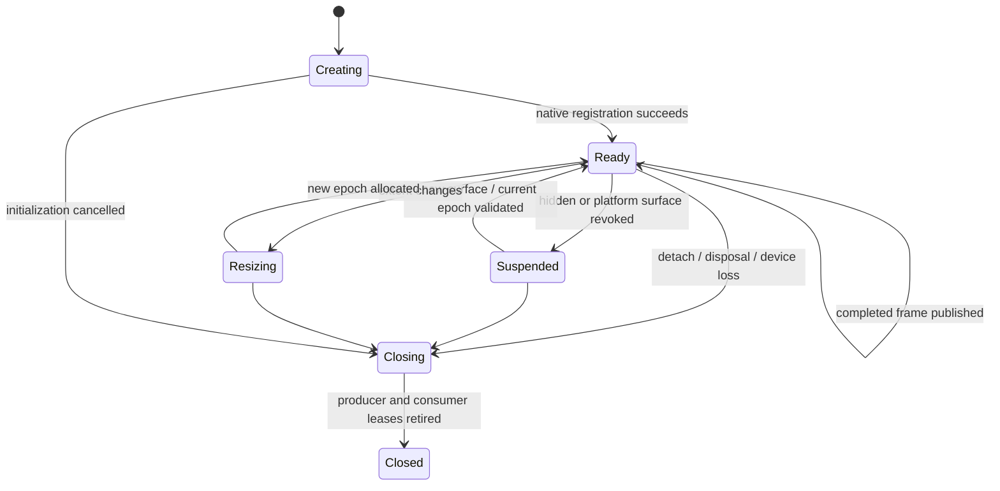

# Native presentation and resource contract

Status: design to implement, checked against the current pinned wgpu source and
Flutter embedding contracts on 26 September 2026. Shared-texture presentation
has not been implemented or verified in this repository.

Read [the public API design](native-3d-api.md) first. This document fixes the
boundary between the native renderer and Flutter so platform work can proceed
without exposing platform details to application code.

## Output contracts

Ordinary rendering must not require pixels to cross FFI. Use these internal core
contracts in `packages/gpu3d/lib/src/rendering/frame_output.dart` and
`render_backend.dart`:

```dart
abstract interface class RenderBackend {
  DeviceCapabilities get capabilities;
  Future<FrameOutput> render(FrameSubmission submission);
  Future<void> close();
}

sealed class FrameOutput {
  FrameStats get stats;
}
class PresentedOutput extends FrameOutput {
  SurfaceKey get surface;
  int get epoch;
  int get frameId;
}
class ReadbackOutput extends FrameOutput {
  ImageData get image;
}

class FrameSubmission {
  SceneSnapshot get scene;
  CameraSnapshot get camera;
  OutputTarget get target;
  PhysicalSize get size;
  FrameTime get time;
}
```

`SceneSnapshot` contains stable node/resource IDs, changed transforms and draw
commands. `CameraSnapshot` is immutable and includes camera-relative origin,
projection and clip convention. `ImageData` is owned byte storage plus size,
pixel format, alpha convention, row stride and color space. `PhysicalSize` is
positive integer width/height. `SurfaceKey` identifies a renderer-owned surface
by slot and generation; it cannot be cast into a native pointer.

`OutputTarget` is either `SurfaceTarget(SurfaceKey, epoch)` or
`ReadbackTarget(PixelFormat, ColorSpace)`. A `PresentedOutput` is a receipt for a
published frame, not a texture lease that Dart must release. Native code retains
the actual surface buffer until both producer and consumer have finished.

`FrameStats` includes `surfaceEpoch`, `frameId`, `presentationPath`,
`cpuBuildTime`, `cpuSubmitTime`, nullable `gpuTime`, `drawCalls`, `triangles`,
`uploadedBytes`, `readbackBytes`, `residentBytes`, `coalescedFrames`, `droppedFrames`
and the effective `physicalSize`.
`DeviceCapabilities` holds typed `RenderFeature` support and `DeviceLimits` for
texture extents, storage/uniform limits, sample counts and resource budgets.
`RendererInfo` combines these with adapter/backend identity.

Flutter holds one stable texture ID per view attachment. Resize changes the
native surface epoch, not the widget's ownership model. `FramePresenter` becomes
an internal adapter selected by `OutputTarget`; the old public RGBA presenter
remains a legacy readback adapter during migration. Capture/export explicitly
requests a readback target. Ordinary `afterRender` hooks receive `FrameStats`,
not a pixel buffer that would force all backends to read pixels.

## Surface state and synchronization

`SurfaceSession` in the Flutter adapter exposes `textureId`, `key`, `epoch`,
`size`, `resize(PhysicalSize)`, `suspend()`, `resume()` and asynchronous `close()`.
Registration/unregistration follows each embedding API's thread rules. Scene
updates stay on Dart's owning isolate. GPU allocation/submission stays on the
native render worker; platform callbacks only publish or invalidate surface
state and never wait for a long GPU operation.



Each frame buffer follows `available -> encoding -> submitted -> published ->
retiring -> available`. Reuse requires producer GPU completion and consumer
release. A texture notification, Dart receipt, callback return or widget rebuild
is not, by itself, evidence that the compositor has finished sampling a buffer.
The platform adapter must establish the actual ownership/fence rule in its proof.

Start with a maximum of three native presentation buffers and two submitted GPU
frames per view. Coalesce pending requests to the newest scene/camera revision
when no slot is available. Do not grow the queue or overwrite a published buffer.
Make these limits tunable only within negotiated resource budgets. Report dropped
requests separately from failed frames.

Epochs change on resize, surface recreation and device recovery. A completion for
an old epoch is retired without publication. Rapid resize retains old buffers
until safe and has a hard memory budget; allocation failure retains the last
valid frame and reports an issue. Zero logical extent suspends allocation.

Define alpha, color and orientation fixtures before showing a textured model:
four distinct corner colors, fractional-alpha edges over a Flutter checkerboard,
known sRGB patches, odd row widths and both portrait/landscape layouts. Flutter's
transform/opacity/clip composition must agree with a reference `Image` widget.

## Platform decisions and proof gates

| Target | Proposed path | Evidence required before enabling it |
| --- | --- | --- |
| macOS/iOS | IOSurface-backed CVPixelBuffer pool, Metal texture views, FlutterTexture registration | GPU completion before publication; pool reuse only after all consumers release; zero CPU image reads; engine detach and resize |
| Android | Flutter SurfaceProducer, current Surface to ANativeWindow, wgpu Vulkan surface presentation | Actual device Vulkan path, replacement surfaces, rotation/crop, queue backpressure and cleanup callbacks |
| Windows | D3D12 producer and Flutter GPU-surface registration through a compatible shared DXGI resource | Adapter identity, permitted resource format, producer/consumer fence protocol, handle ownership and compositor import |
| Linux | Qualification spike against the pinned Flutter Linux embedder | GPU-only Vulkan presentation with an acceptable compositor path and complete lifetime tests |

These are proposed integrations, not equivalent implementations supplied by wgpu.
GPU-to-GPU copies are acceptable when required for interop; production viewport
presentation must not perform per-frame CPU readback. Report both CPU and GPU
copies honestly. The library controls its 3D renderer; Flutter controls its own
compositor. A compositor bridge does not authorize adding an OpenGL 3D renderer.

### Apple

Register and unregister textures on the platform thread. Flutter requests
`copyPixelBuffer` on its raster thread, so publish a retained completed buffer
through a small synchronized slot. That callback must not render, wait on the GPU
or access Dart. Follow the API's ownership convention for the returned buffer.
[Flutter registry contract](https://api.flutter.dev/ios-embedder/protocol_flutter_texture_registry-p.html),
[Flutter texture contract](https://api.flutter.dev/ios-embedder/protocol_flutter_texture-p.html).

Create the CVMetalTextureCache with the same Metal device used by wgpu. The first
proof can render into an owned wgpu target and perform a GPU copy into a shared
buffer. Importing the shared target directly is an optimization after the proof.
Use pool allocation ownership, not manual retain-count polling, to avoid reusing
a buffer retained by Flutter. Validate color/alpha conversion at the final pass.

Isolate any unsafe wgpu HAL import in `interop/metal.rs`, with an explicit safety
comment covering device identity, texture usage/format, retained Objective-C
objects and destruction ordering. The pinned wgpu `create_texture_from_hal` API
requires the imported texture and device to satisfy its safety contract.
[wgpu 30.0.1 device API](https://docs.rs/wgpu/30.0.1/wgpu/struct.Device.html).

### Android

Use `SurfaceProducer`; implement `onSurfaceAvailable` and `onSurfaceCleanup`.
Resolve the current surface for drawing because resize/format/lifecycle changes
can replace it. Revoke the old surface generation immediately on cleanup, release
its ANativeWindow reference only after in-flight work is safe, and acquire a new
reference for a replacement. Do not depend on the undocumented `scheduleFrame`
method. Respect crop/rotation behavior reported by the producer.
[SurfaceProducer](https://api.flutter.dev/javadoc/io/flutter/view/TextureRegistry.SurfaceProducer.html),
[callbacks](https://api.flutter.dev/javadoc/io/flutter/view/TextureRegistry.SurfaceProducer.Callback.html).

Pass platform-created surfaces through a native registry, not by sending Java
objects or pointers into Dart. Set physical extent through `setSize`. The Vulkan
surface must retain the ANativeWindow for its full lifetime. Prove this on real
mobile GPUs and after repeated background/foreground cycles; simulator behavior
and API presence cannot establish device interoperability.

### Windows

Flutter exposes a GPU surface descriptor with a handle, dimensions, pixel format
and release callback. The handle form depends on the selected GPU surface type.
Use the callback as a resource-ownership signal; prove GPU synchronization
separately. Do not assume callback return implies completion of all GPU reads.
[GPU surface descriptor](https://api.flutter.dev/windows-embedder/struct_flutter_desktop_gpu_surface_descriptor.html),
[embedding header](https://api.flutter.dev/windows-embedder/flutter__texture__registrar_8h_source.html).

The proof must establish whether the pinned embedder accepts our D3D12-produced
shared resource directly or needs a D3D11 interop copy. Select matching adapters
by LUID. Define the shared-handle type and who closes it. If a bridge copy is
needed, trace it and keep it entirely on the GPU. Test integrated/discrete adapter
selection, resize, detach and completion arriving after close.

### Linux

The current documented Linux texture extension exposes GL textures or pixel
buffers. It does not establish a Vulkan import path for this project.
[Flutter Linux texture interface](https://api.flutter.dev/linux-embedder/struct___fl_texture_interface.html).

Keep Linux labeled experimental until a host proves the chosen Vulkan/compositor
interop. A native Vulkan readback renderer remains a diagnostic option. Do not
silently enable it under `requireSharedTexture`, and do not claim a new Linux
embedder or direct-surface integration is implemented by writing a placeholder.
The four requested primary targets remain iOS, Android, macOS and Windows.

## ABI and native ownership

Retain ABI v1 while v2 is introduced. Give v2 entry points an `fg2_` prefix and
explicit struct sizes. Define all layouts in one checked-in C header and generate
Dart declarations from it. Keep counts, capacities, endianness and string encoding
in that header. Rust rejects stale handles, invalid epochs, excessive sizes and
bad descriptor combinations before touching a driver.

Core v2 operations: create/close renderer, query capabilities, register/revoke a
surface token, resize a surface, submit a scene packet, collect completion/issue
records, request explicit readback, release resources and query diagnostic counts.
Return typed status codes and request-local error records. Do not use a global
last-error string for concurrent work. Native control records never carry app
credentials, filesystem access or arbitrary executable callbacks.

Exactly one native runtime registry must back both Dart FFI and the platform
presentation plugin. Export a runtime-instance token and test that both bridges
report the same token. Accidentally loading a second Rust library can make every
handle invalid or leak a device, even when both libraries have identical code.

Begin with the current JSON scene payload inside a versioned frame envelope so
interop can be tested without changing scene encoding. The resource milestone
replaces full geometry JSON with validated binary uploads and scene deltas.
Use `TransferableTypedData` for large Dart worker transfers. No per-mesh FFI call,
per-frame geometry stringify or arbitrary native pointer reaches application code.

Native waits need a bounded polling/timeout strategy and device-loss checks.
Disposal cannot sit forever behind an unbounded GPU wait. Revoke surfaces first,
stop new submissions, cancel queued work, retire completed resources and report
any device that cannot drain. A forcibly lost device may abandon GPU work, but
must still close CPU handles and platform registrations safely.

## Measurement and release gates

Capture backend/adapter, OS, architecture, driver, resolution, scene fixture,
build mode, warm-up duration, frame count and thermal/power conditions. Start with
these repeatable workloads:

- One mesh at 1080p for presentation overhead and alpha/orientation checks.
- 10,000 shared instances to expose draw-call and update costs.
- A licensed textured glTF scene with a fixed light/camera setup.
- Two viewports sharing CPU geometry with independent cameras.
- The WGS84 globe, then a streamed terrain fixture after that milestone.

Measure at least 300 frames after warm-up and publish p50/p95/p99 CPU and available
GPU times, memory and dropped frames. Set a 60 FPS desktop / 30 FPS mobile target
for the documented representative fixtures, not for every possible scene. Keep
zero CPU presentation readback as a binary gate. Timestamp support and performance
budgets are separate capability checks; unavailable measurements remain unknown.
