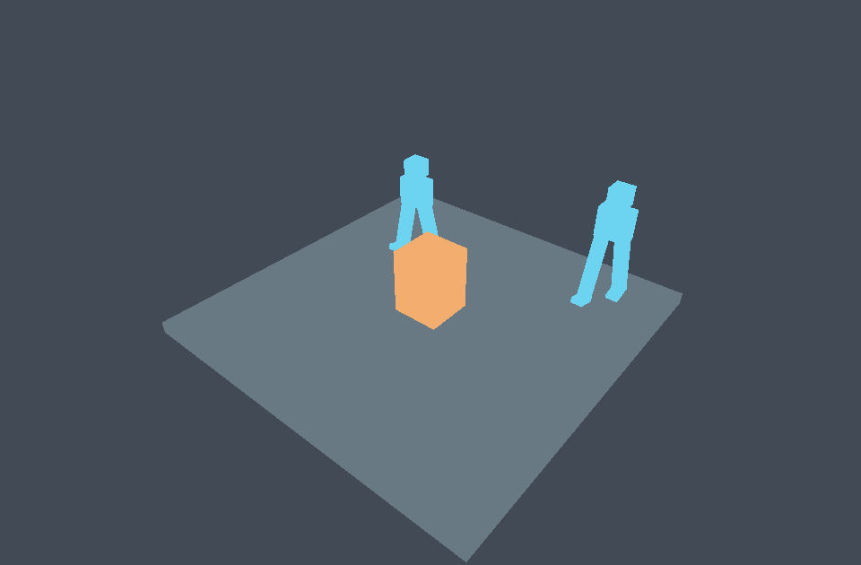

# Character and navigation qualification

You can run root motion, capsule collision, generated navigation, obstacle
replanning, foot IK and explicit rig retargeting together in Character Lab.
The macOS Metal and Pixel Vulkan presentation tests passed on 2026-10-02.
Final regression checks continued on 2026-10-03 with Flutter 3.47.5 and Dart 3.13.4.
The iPhone Metal presentation test passed after a clean build on 2026-10-03.

## Implemented coverage

| Capability | Implementation and evidence |
| --- | --- |
| Root motion | Signed action traversal retains forward, reverse and multiple loop crossings. The pose processor strips root translation and yaw before skinning. External timeline driving advances once per Rapier fixed step. |
| Collision | Native Rapier upright capsule sweeps, sliding, stairs, slope limits, snap, sensors, collision groups, grounding and moving-platform carry. The motor adds gravity and grounded jumping. |
| Generated navigation | Bounded layered cells from static world-space triangles, with slope, step, headroom and footprint checks. Tests cover seams, holes, duplicate coverage, walls, floors, budgets and cancellation. |
| Dynamic obstacles | Versioned box snapshots invalidate routes. Followers replan from the resolved position and stop when no current route is available. The example updates its collider and navigation obstacle together. |
| Pipeline input | A completed load job supplies geometry through the public model API. The bake pins bundle, source, node, primitive and transform identities. Released jobs are rejected. |
| IK | Analytic two-bone solving with pole and bend limits, bounded look-at, unreachable targets and immutable pose edits. Foot placement uses real Rapier ground rays in model coordinates. |
| Retargeting | Explicit bind-relative joint mappings, axis corrections and unit conversion preserve target bone lengths. Tests place a retargeted longer-leg foot onto a ground target after solving. |
| Runtime agents | Scoped host commands expose movement, look-at, foot targets, retarget controls, jumping, obstacle replacement and rebaking. Registry checks cover passive reads, denial, stale revisions, retry keys, removal and cleanup. |

## Native presentation

The fixture loads two glTF skins with nine joints each. The second rig has legs
30% longer than the moving rig. Both use the imported model's native deformation
path. The test drives a real Flutter SceneView and the platform surface channel.
It asserts arrival around a live obstacle, root stripping, grounding, target bone
length, pause/resume, removal, visible surface presentation and resource cleanup.

| Device | Result | Presentation evidence |
| --- | --- | --- |
| macOS 27.0.1, Apple silicon, Metal | Passed | 48 frames; 1800x1074 to 780x1092; 456 fixed steps; zero presentation readback bytes |
| Pixel 9 Pro, Android 17/API 37, Vulkan | Passed | 48 frames; 2025x1024 to 878x1013; 453 fixed steps; zero presentation readback bytes |
| iPhone 16 Pro, iOS 27.0, Metal | Passed | 49 frames; 2700x1281 to 1170x1266; 453 fixed steps; zero presentation readback bytes |
| iPad Pro 13-inch M4, iOS 27.0 | Blocked before launch | Clean build and signature verification pass. Installation exceeds the device's three-app limit for a free developer profile. |
| Windows DX12 | Not run | No Windows GPU host or registered runner available. |
| Linux Vulkan | Not run | No Linux presentation run performed. |

All three passing runs include a 900x640 logical desktop layout and a 390x700 narrow
layout, with no Flutter exceptions and more than 400 logical pixels of viewport
height at the narrow size. A presented-frame record matches current scene state.
A normalized viewport pick finds the imported character's source identity, and
an authorized movement command sets its return goal. Picking uses CPU triangles;
it does not establish exact rendered pixel visibility.

Renderer/session counts, held drawables or Android surfaces, physics native
counts and agent registrations return to their baselines after disposal.
The final run summaries were captured in `/tmp/zyren-character-macos-agent.log`
and `/tmp/zyren-character-pixel-agent-retry.log`. These local logs are temporary;
the assertions and reproduction commands live in this package.

The iPhone rerun used an unlocked device and `flutter drive --publish-port` over
Wi-Fi. An initial retry encountered a file being added by concurrent Flutter work,
so its fallback launch was not used as the final qualification result. The next
run built cleanly in 19.0 seconds, installed and launched in 22.7 seconds, and
passed the full test in 15 seconds. Its log is
`/tmp/zyren-character-iphone-clean-retry.log`. This supersedes the earlier iPhone
session failure. The iPad still reported that a passcode was required on this retry.

After the iPad was unlocked on 2026-10-03, its build passed in 25.7 seconds and
`codesign --verify --deep --strict` passed. Direct CoreDevice installation then
reported that all three free developer profile app slots were occupied. The app
has not launched on iPad, so no iPad rendering or cleanup result is claimed.
The install diagnostic is in `/tmp/zyren-character-ipad-install.txt`.



This image comes from `example/app/lib/native_capture.dart`, a separate 960x630
Metal readback after 90 fixed steps. It shows both skinned rigs and the collision
obstacle across four draw calls. The capture deliberately reads pixels; it is
separate from the zero-readback Flutter presentation checks above.

## Reproduce

Regression results: 23 character tests pass with `RUN_NATIVE_GPU=1`, 15 navigation
tests pass, 23 physics tests pass, 54 timeline tests pass and 17 focused imported
animation tests pass. The glTF timeline suite passes five CPU tests; its four
separate GPU tests were skipped in that suite. Character Lab's native presentation
tests above passed on both available backends. The character suite includes the
existing particle adapter's real Metal state and playback test.

Analysis and the package boundary/Apple ABI header guard pass. During concurrent
workspace testing, other hook runs overwrote the shared manifest. The final
character run used a temporary package-local manifest pointing at the same built
Rapier and renderer libraries, and all 23 tests passed without skips. No library
or renderer was substituted for that run.

Use Flutter 3.47.5's bundled Dart. Run native package commands sequentially:
the workspace shares its hook manifest. The MCP test takes a private manifest
snapshot and compiles its subprocess against the already-built native libraries.

```sh
cd packages/zyren_characters
RUN_NATIVE_GPU=1 dart test --concurrency=1
cd ../zyren_navigation
dart test --concurrency=1
cd ../zyren_physics
dart test --concurrency=1
cd ../zyren_timeline
dart test --concurrency=1
cd ../zyren_characters/example/app
flutter test integration_test/character_test.dart -d macos --no-pub
flutter test integration_test/character_test.dart -d 47121FDAP002C7 --no-pub
```

For an unlocked wireless iPhone, use `flutter drive` with local-network access:

```sh
flutter drive --driver=test_driver/integration_test.dart \
  --target=integration_test/character_test.dart \
  -d 00008140-001958CC11E0801C --publish-port --no-pub
```

## Bounds and remaining qualification

The generated navigation surface uses conservative cells and four-neighbor
links. It is not a shortest-path funnel mesh. Obstacles are box snapshots; the
host must keep them synchronized with its physics objects. Baking animated or
skinned geometry requires a static snapshot. Cell, triangle and operation limits
are explicit, and exhausted work returns no partial route or bake.

Root motion requires a top-level imported root and fixed steps no longer than
100 ms. Crossfades use mean endpoint weights. Cubic yaw unwrapping samples each
key interval 32 times; pathological cubic spins need denser authored keys. Rigs
require positive uniform ancestor scales and explicit joint mappings. Retargeting
does not transfer morph expressions or infer a humanoid skeleton.

iPad needs an available developer app slot and a completed device run. Windows
and Linux need their own native runs. The tested procedural
bipeds do not qualify arbitrary production rigs, full-body IK or crowd avoidance.
No publication, push or merge is part of this qualification.
