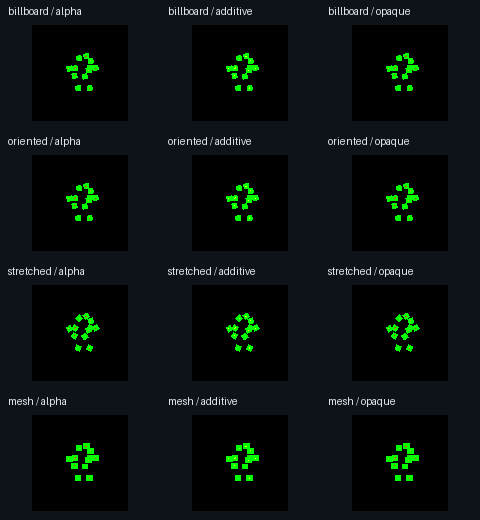

# Particle qualification, 2026-10-02

Implementation commit: `2235296`, following the initial package in `7bd0450`.
The accompanying example and qualification files are committed separately.
You can reproduce the package tests with the commands in the README.

## Executed checks

| Check | Result |
| --- | --- |
| Particle package, native GPU enabled | 19 tests passed on Apple M3 Max, macOS 27.0, Metal |
| Reference timing | Identical packed evolution at 30, 60, 120 and 144 display Hz |
| GPU/reference state | Position and velocity tolerance 0.00001; noise tolerance 0.00002 |
| GPU/reference images | 24 captures: four appearances, three blends, two paths; mean byte error below 1 |
| Camera and depth | Camera reversal changes alpha order; depth test and depth write change center pixels as expected |
| World transforms | Birth rotation and scale persist after parent moves; images match at origin and at (600000000, -300000000, 200000000) |
| World collisions | Plane reflection passes at zero and 600000000 world height, on both paths |
| Lifecycle | Prewarm, pause, resume, burst, drain, reset, restore, independent views, reattach, failed attach and atomic configure pass |
| Ownership | Zero scoped resident bytes/materials after disposal; geometry retirement checked after a subsequent empty frame |
| Native shared material regression | Two Dart alpha/blend tests and four Rust shader-material/render-graph tests pass, including device tests |
| Analysis and formatting | Particle package and example clean |
| Package boundary guard | Passed |
| Rust formatting | Passed |
| Rust strict Clippy | Blocked by three `manual_is_multiple_of` warnings in `compression.rs` and one `manual_inspect` warning in `render_graph/mod.rs`; unrelated files preserved |

## Example and platforms

Flutter 3.47.5 was used for all local Flutter checks.

| Platform | Build | Execution |
| --- | --- | --- |
| macOS, Apple M3 Max | Debug app passed | All five effects and controls passed; native presentation has zero frame readback bytes |
| Android, Pixel 9 Pro, Android 17 | Debug APK built and installed | Vulkan interaction test passed in 14 seconds after launch; zero frame readback bytes |
| iOS simulator | Debug simulator app built | Build only |
| iOS physical device | Signed debug and profile apps built | Direct profile install rejected because the phone already has the maximum three free-profile development apps; no particle execution result |
| Linux Vulkan | Runner and CI build job supplied | No Linux host or GPU available here |
| Windows DX12 | Runner and CI build job supplied | No Windows host or GPU available here |

The macOS and Android interaction check selects Sparks, Sprites, Trails, Flow
and Meshes, inspects live particle state, verifies pause, resumes, resets and
bursts each effect, then requests 1200x760 and 390x740 content bounds, constrained by the device
window. Controls wrap without overflow and inspection works at the full desktop
window and at 390 logical pixels wide. The running macOS
app was also visually inspected: sparks render above the floor, controls remain
visible, and Pause changes to Resume. Accessibility exposes the effect choices,
playback actions and the native viewport label.

A longer desktop inspection exposed Flutter AX-tree update errors when the
native drawing surface contributed child semantics. The canvas now exposes one
labelled image and excludes that child tree; playback controls retain their own
semantics. The macOS integration test passes with semantics explicitly enabled,
including the viewport label, and the subsequent app log had no AX-tree errors.
Manual AX activation could not be completed reliably through desktop automation,
so manual accessibility qualification remains incomplete.

The final Android accessibility-enabled rerun paused after the phone entered
its screensaver. `dumpsys activity` confirmed Particle Lab was paused and not
visible. The earlier complete Vulkan interaction result above remains valid;
the final accessibility-enabled Android rerun has no completed result.

Windows and Linux use explicit native image readback presentation in this
example. They still render through the native backend. Neither their runtime
behavior nor iPhone rendering is qualified by the macOS/Android results.

For wireless iOS, the sample includes a driver entrypoint:

```sh
flutter drive --driver=test_driver/integration_test.dart \
  --target=integration_test/particles_test.dart -d <device-id> --publish-port
```

`flutter test` itself rejects `--publish-port`. The driver built the signed app,
then reported no VM service after 75 seconds. A direct profile installation with
`devicectl` identified the concrete blocker: `MIInstallerErrorDomain` 13, the
phone's limit of three installed apps under its free developer profile. Existing
apps from other work were preserved. No rendering result was inferred from the
signed build.

The new CI workflow runs analysis, format, reference tests, package boundaries
and desktop/mobile builds. Native Metal tests are an explicit workflow-dispatch
option for a runner with a GPU. This workflow has not been run remotely.

## Measured capacity

[capacity.json](capacity.json) records one warmed local run with 65,536 particles
and alpha sorting. Creation took 252,517 microseconds; the first update took
19,949 microseconds of host time and submitted 138 compute dispatches with 448
uploaded bytes. Explicit readback confirmed 65,536 live particles.

The scoped resource registry reported 8,913,136 resident bytes before the first
scene draw. That excludes carrier geometry which the scene renderer uploads
when drawn. Routine simulation readback was zero. GPU time is unknown, and
these host measurements do not establish frame rate or a performance budget.

[measurements.json](measurements.json) contains per-mode measurements from the
native image checks. Tests read images and particles explicitly; those test
readbacks are separate from ordinary simulation work.



The contact sheet is assembled from 96x96 Metal RGBA captures. Its atlas fixture
uses green at the sampled animation time. It verifies rendering coverage and
path agreement; it is not a benchmark screenshot.

## Remaining capability limits

Soft intersections are unavailable because the shared native mesh-material API
has no sampled scene-depth input. The package throws on that request and tests
the failure cleanup. Alpha sorting is per emitter, with ordinary scene ordering
between emitter meshes and ribbons. Mesh particles are unlit. Indirect draw
submission is not exposed through the shared mesh API.

Physical iOS, Linux and Windows execution remain unverified. The package and
example are local, unpublished work.
