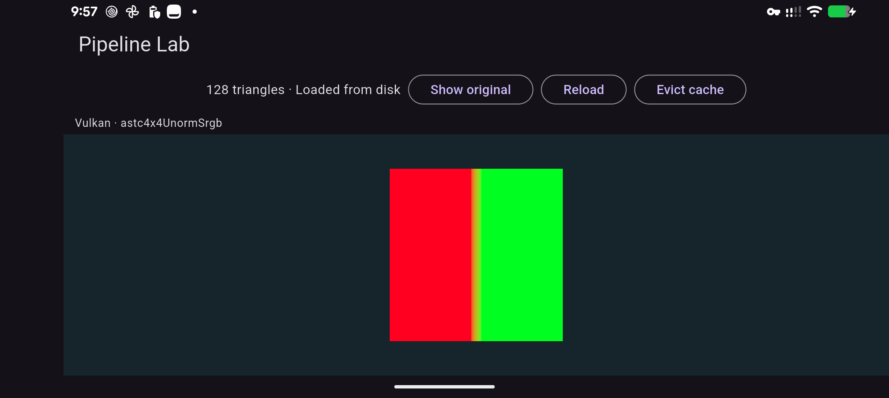

# Pipeline mobile check, 2026-10-03

The Pixel 9 Pro passes the full native integration test on Android 17 (API 37).
You can repeat it with the pinned Flutter 3.47.5 SDK:

```sh
fvm flutter test --no-pub integration_test/pipeline_test.dart -d <device-id>
```

The run used Vulkan's native SurfaceProducer path, reported as `sharedTexture`,
and device-selected `astc4x4UnormSrgb`. The logical scene viewport was
884 x 250.6667 at DPR 2.25 in landscape. The first attempt failed because the test
expected `nativeView`; the public Android runtime configures a surface presenter.
The assertion now distinguishes Android from the Apple native-view presenter.

The passing run covers the 128-triangle LOD, source-ID pick `part:grid`, a later
presented frame after each visual action, 512-triangle original geometry, runtime
and disk eviction, the visible cache miss, restoration and controller disposal.
The retained bundle version is
`06690ebeaaed7fcd497be409d750ead4729818f48e8e8b0d6406b9a7dc1216c2`.
Rendered pixel visibility remains unknown. This run did not assert readback-byte
counters or compare Android texture pixels numerically.

A separate normal app launch was inspected in a device screenshot. The texture
and all controls are visible in landscape. Portrait visual review remains open.
The pipeline test and preview processes have stopped, releasing the Pixel.



## Apple mobile result

The iPad is connected wirelessly. `flutter test` failed before launch because it
disables port publication. The new `test_driver/pipeline_test.dart` uses Flutter's
existing integration driver with `flutter drive --publish-port`.

The signed attempt then failed because the Apple development account had reached
its limit of 10 new App IDs in seven days. No development profile exists for
`dev.zyren.zyrenPipelineLab`. The actual integration-test entry point builds for
arm64 with signing disabled, but no pipeline test ran on the iPad.

A temporary test build was prepared using the existing Interaction Lab profile,
and the original signed app was preserved for restoration. Both pass local deep
signature verification. Installing that build would replace Interaction Lab, so
it remains uninstalled pending explicit authorization. The repository's pipeline
bundle identifier remains unchanged. The iPhone's active Studio session was left
running.
