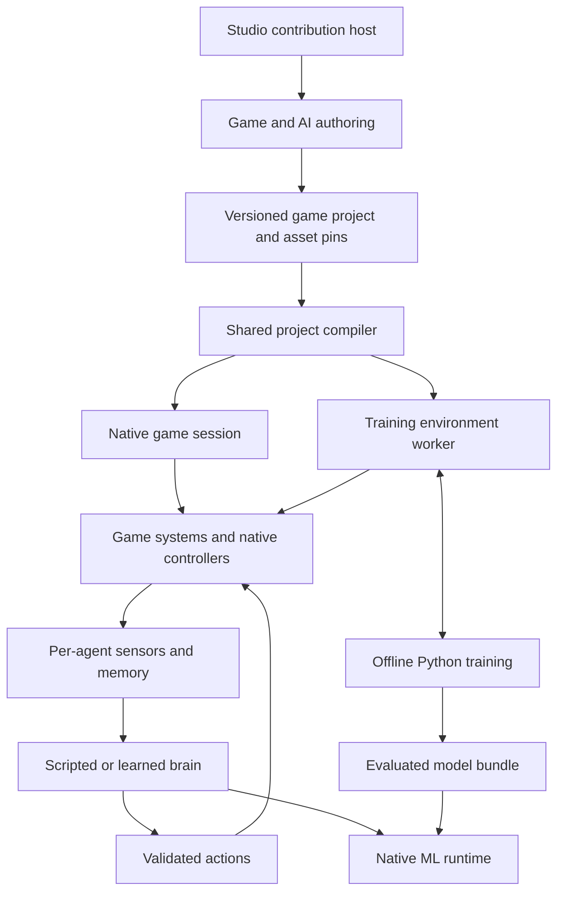

# Game and AI design

You can author a game in Studio, play it locally, record demonstrations, train a
policy and attach the evaluated model to an actor. A saved game must retain its
behavior when you reopen it or export it into a Flutter app.

This is a proposed design dated 2026-10-03. Parameter counts, actor counts and
timing budgets below are initial acceptance targets, not measured capability.

## Source audit

| Existing source | Reuse | Gap this program owns |
| --- | --- | --- |
| `packages/zyren/lib/src/plugins/engine.dart` | `ScenePlugin`, lifecycle, typed services and resource scopes | Game simulation lifecycle and a single simulation clock |
| `packages/zyren_physics/lib/src/plugin.dart` | `PhysicsPlugin.advance`, `beforeStep`, transform bindings and cleanup | Explicit external stepping mode that cannot also advance in `beforeRender` |
| `packages/zyren_physics/lib/src/physics.dart` | Native Rapier bodies, queries, joints, fixed stepping and snapshots | Wheeled vehicle adapter, replay policy and runtime entity mapping |
| `packages/zyren_characters/README.md` | Character motor, root motion, IK, retargeting and animation transitions | Player/NPC intent routing and gameplay ownership |
| `packages/zyren_navigation/README.md` | Generated surfaces, clearance, obstacles and route followers | Game-controlled updates, interaction destinations and sensor knowledge boundaries |
| `packages/zyren_studio/lib/src/document.dart` | Stable node IDs, prefabs, asset pins and immutable documents; concurrent schema 3 adds primitives | General versioned document extensions and component overrides in the next compatible schema |
| `packages/zyren_studio/lib/src/history.dart` | Unified document history | Extension data in the same undo/redo transactions |
| `examples/studio/lib/studio_editor.dart` | Working Flutter editor composition, inspector, selection and command gates | Reusable editor contribution API and game panels |
| `packages/zyren_studio/lib/agent_extensions.dart` | Concurrent `StudioAgentExtension` and scoped provider/plugin lifetime | Reuse that contract for game tooling; extend the editor separately for panels and authoring |
| `examples/studio/lib/studio_preview.dart` | Separate scene and asset scope for preview | Game play sessions, pause/step, runtime inspectors and selective apply-back |
| `packages/zyren_pipeline/README.md` | Pinned assets, offline bundles, cache and build receipts | Validated game/model artifacts and a runtime project compiler adapter |
| `packages/zyren_audio/README.md` | Native spatial playback and host-controlled focus | Gameplay sound events for hearing and a Flutter focus adapter |
| `packages/zyren_capture/README.md` | Native color capture and capability reporting | Persistent sensor targets; public depth/object-class outputs are currently missing |
| `packages/flutter_zyren/lib/src/widgets/zero_state.dart` | Shared illustrated `ZeroState` | Game-specific copy, illustrations and recovery actions |
| `packages/flutter_zyren/lib/src/widgets/onboarding_provider.dart` | Registered `OnboardingProvider` walkthroughs | Registered game and AI authoring walkthroughs |
| `packages/zyren_agents/README.md` and `lib/workflow.dart` | Scoped inspection/commands, MCP and concurrent external model/tool workflows | Game, model and training providers; NPC control still uses the separate runtime contract |

The current capture API starts an isolated capture job and writes PNGs. It is not
a per-agent real-time camera sensor. A6 must implement and qualify that path.
Existing Studio collaboration covers a subset of edits; game component conflicts
need explicit support before concurrent editing is advertised.

Studio schema 3, primitive modeling and agent-extension files were active concurrent
edits during the final audit. They were read for compatibility, not changed or
verified by this planning work. S1 targets schema 4 based on that snapshot and must
re-read the current schema before reserving its version. Never overwrite schema 3
or discard its new primitive kinds to add game components.

## Requirements and task coverage

| ID | Required outcome | Tasks |
| --- | --- | --- |
| R01 | Optional game/ML packages with no reverse dependency from the renderer | G1, A1, Q5 |
| R02 | Stable entities, typed components, prefabs and versioned project data | G1, S1-S3 |
| R03 | One fixed-step simulation for play, replay and training | G2, T1, Q1 |
| R04 | Keyboard, pointer, touch and controller input with focus handling | G3, Q3 |
| R05 | Character movement, camera rigs and imported animation | G4, Q1 |
| R06 | Native wheeled vehicles and character/vehicle possession | G5, Q1 |
| R07 | Interactions, triggers, rules, objectives, inventory and abilities | G6, S3 |
| R08 | Spawning, pooling, level changes and bounded cleanup | G1-G2, G7, Q2 |
| R09 | Versioned save games, replay and compatible restore | G7, Q2 |
| R10 | Studio extension API and shared editor commands/history | S1-S2 |
| R11 | Inspectors, prefab overrides, level tools and reusable templates | S3, S5 |
| R12 | Isolated play mode, pause/step and reviewed apply-back | S4, Q2 |
| R13 | Compact accessible desktop/narrow UI and registered tours | S2, S6, Q3 |
| R14 | Offline project export and runnable native Flutter host | G7, S7, Q1 |
| R15 | Typed native ML execution, bounded queues and resource lifetime | A1-A2, Q2 |
| R16 | Model manifests, signatures, hashes, preprocessing and compatibility | A1, T5, S6 |
| R17 | Field of view, occlusion, hearing, body state and local spatial sensors | A3, Q1 |
| R18 | Per-agent memory, goals and no hidden-world observations | A4, T4, Q2 |
| R19 | Separate character and vehicle action contracts | G4-G5, A5, T3 |
| R20 | True native camera observations, RGB and depth | A6, T6, Q4 |
| R21 | Shared model weights, independent state and batched decisions | A2, A5, Q4 |
| R22 | Scripted behavior, learned policy and hierarchical skill selection | A4-A5, S6 |
| R23 | Same-runtime training workers and repeatable resets | T1, Q1 |
| R24 | Demonstrations, curricula, imitation and reinforcement learning | T2-T3 |
| R25 | Evaluation on unseen levels, seed sets and failure conditions | T4, Q1 |
| R26 | Quantization, export parity and model lifecycle | T5, A1, A5 |
| R27 | Cooperative/competitive agents and controlled self-play | A7, T6 |
| R28 | Studio sensor, brain, training and evaluation tools | S6, T2-T6 |
| R29 | Scoped external AI tooling through existing shared providers | G7, S6-S7, A7, Q2 |
| R30 | Native platform qualification and honest performance budgets | Q3-Q5 |
| R31 | Examples, API docs, operator setup and release records | Q1, Q5 |
| R32 | Extension points for game systems, controllers, sensors and trainers | G1, S2, A3-A5, T3 |

## Package boundaries

| Proposed package or tool | Owns | Allowed direct project dependencies |
| --- | --- | --- |
| `zyren_game` | Project/runtime data, entities, components, systems, input contracts, rules, saves and replay contracts | `zyren`; optional agent adapter may use `zyren_agents` |
| `zyren_game_native` | Scene presentation adapter, native physics, character/vehicle controllers, navigation, audio and effects integration | `zyren_game`, `zyren`, `zyren_physics`, `zyren_characters`, `zyren_navigation`, `zyren_timeline`, `zyren_gltf`, `zyren_gltf_timeline`, `zyren_audio`, `zyren_particles` |
| `zyren_ml` | Tensor/model contracts, native ONNX Runtime bridge, workers and diagnostics | `ffi`, native build tooling; optional adapter may use `zyren_agents` |
| `zyren_game_ai` | Perception, beliefs, goals, behavior assets, action contracts and policy scheduling | `zyren_game`, `zyren_game_native`, `zyren_ml`, `zyren`, `zyren_agents` |
| `flutter_zyren_game` | Flutter game host, input adapters, lifecycle, HUD bindings and gamepad platform bridge | `flutter_zyren`, `zyren_game`, `zyren_game_native` |
| `flutter_zyren_studio` | Reusable editor contribution host extracted from the existing example | Flutter, `flutter_zyren`, `zyren_studio`, existing inspector/tools dependencies |
| `zyren_game_studio` | Dart project compiler/asset adapters and Flutter game/AI contributions | `zyren_studio`, `flutter_zyren_studio`, game packages, `zyren_pipeline`, `zyren_ml`, `zyren_agents` |
| `tool/zyren_train` | Python environments, algorithms, datasets, export and evaluation | Python packages locked by T1; worker executable supplied by game project |
| `examples/game_lab` | Playable templates and the compiled Dart training worker | The runtime packages; Flutter entry point and renderer-free worker have separate imports |

The two public capabilities are game development and ML. The adapters keep
native assets, Flutter UI and training dependencies out of apps that do not need
them. In particular, `zyren_game` can run a rules-only test without loading ONNX,
and `zyren_ml` can execute a non-game model without importing the scene engine.

`zyren_studio` stays Dart-only. It must not depend on Pipeline, which already
depends on Studio. The Dart-only `compiler.dart` entry point in
`zyren_game_studio` imports only Dart libraries despite its package also providing
Flutter editor widgets. Keep that separation under an import test.



## Runtime and saved identity

Use a small typed component/system registry over the existing scene graph.
Do not build another transform hierarchy or introduce an ECS framework before a
profile demonstrates the need. `GameEntityId` is a stable authored UUID/string;
`GameEntityHandle` adds a generation for each runtime spawn. Render objects,
physics handles and imported source IDs remain separate mappings.

`GameProject` contains a schema version, project ID, startup level, level records,
input maps, component schemas, behavior/model references, build profiles and
capability requirements. `GameLevel` stores entities and their component records
against one pinned scene identity. Cross-level references use project/level/entity
triples. Prefab-local references remap on instantiation. Unknown required
components block play/export without losing their authored data.

Studio's next schema, planned as version 4 after the active version-3 modeling
change, adds an `extensions` map of namespaced versioned payloads. Read schema
1, 2 and 3, write schema 4. `zyren.game` stores the project/level component
records; `zyren.game_ai` stores sensor, brain, model and training references.
Keep model weights and demonstrations out of document JSON. Component overrides
participate in the existing prefab and history rules through an extension codec.

Example extension shape, with deliberately small valid data:

```json
{
  "extensions": {
    "zyren.game": {
      "schemaVersion": 1,
      "required": true,
      "data": {
        "projectId": "courtyard",
        "levelId": "yard",
        "entities": [{"id": "guard-a", "nodeId": "guard-model", "components": [
          {"type": "game.character", "version": 1, "data": {"radius": 0.3, "height": 1.8}},
          {"type": "game.brain", "version": 1, "data": {"brainId": "guard-v1"}}
        ]}]
      }
    }
  }
}
```

The project compiler validates the entire dependency set before replacing a
working play session. It returns `CompiledGameProject`, a runtime asset independent
of Studio widgets and documents. Export includes a typed artifact manifest,
source hashes, schema/compiler versions, asset/model pins and required native
capabilities. A failed build leaves the previous build selectable.

## Simulation contract

`GameSession.step()` advances one integer tick at a configured `fixedHz`, initially
60. Compute physics seconds as `1.0 / fixedHz`; do not accumulate rounded
microsecond timesteps. `GameSession.advance(realSeconds)` is the bounded realtime
accumulator. Training calls `step`, never a render callback.

The phase order is fixed:

1. Apply queued spawn/despawn and commands, then resolve possession/input.
2. Accept brain results scheduled for this tick after identity/deadline checks.
3. Apply validated intents, navigation requests, root motion and controller inputs.
4. Step native physics once, resolve triggers and collect collision outcomes.
5. Update rules, objectives, cooldowns, animation state and gameplay sound events.
6. Capture the sensor snapshot and schedule decisions due at this tick.
7. Record state/action diagnostics; render interpolated presentation separately.

Sensor frames identify episode, entity generation, tick, schema and world revision.
Actions identify their observation frame and application tick. The default learned
policy has one decision-interval latency: an observation at tick `t` produces an
action for `t + decisionPeriodTicks`. Training simulates that same delay. Low-level
control can use a different declared interval, including one tick. On a missed
deadline, a controller uses its declared bounded fallback, records the miss and
never applies that result to a later episode.

Realtime catch-up is bounded and reports discarded time. Pause, resume, a hidden
app, model replacement and level unload invalidate queued work as specified by
their session generation. Cleanup waits for native work before releasing buffers.
Replay records accepted actions and their ticks, seeds and engine/build pins.
Cross-platform bitwise physics or inference equivalence is not promised.

`PhysicsPlugin` gets an explicit external driver mode. Its existing automatic
mode remains the default. An externally driven instance never advances from
`beforeRender`, and a game session never also calls `PhysicsWorld.step` behind
that plugin. `CharacterMotor.advance` runs once in the existing `beforeStep` hook.

## Game development features

Components cover render bindings, colliders, characters, vehicles, cameras,
input receivers, interactions, triggers, spawn points, audio emitters, effects,
inventory, abilities, objectives and brain bindings. Systems expose bounded
`start`, `fixedUpdate`, `pause`, `resume` and `dispose` hooks with declared phase
and dependencies. Plugins register typed component codecs, factories, systems
and diagnostic views. Duplicate IDs and dependency cycles fail on construction.

Input actions support move/look, buttons, rebinding, dead zones and device changes.
Text entry, modals and editor gizmos consume input before a play session. Touch
controls are editable Flutter widgets. Desktop/mobile gamepad access has an
explicit native adapter and device qualification, with disconnected-device state.

Camera rigs provide first-person, third-person orbit/follow and vehicle chase,
including obstruction handling. Character and vehicle possession routes one
intent producer to a controller at a time. Collision-aware character movement
uses the current capsule/root-motion implementation. A wheel controller uses
Rapier ray contacts, suspension, tire forces, engine/brake force and steering;
wheel visuals follow the solved controller state. Document its handling limits.

Rules and behaviors reference registered typed Dart actions and predicates.
Provide a state machine and bounded behavior tree for common game logic, plus
utility scores for selecting goals. Saved graphs cannot execute arbitrary source
code. AOT builds compile registered systems; code changes restart play as needed.
Data-only hot reload is transactional and limited to compatible component fields.

Inventory has typed items, stack limits and transactional transfers. Abilities
declare costs, cooldowns, targets and effects. Objectives subscribe to typed
events. Interactions enforce reach, line of sight and current actor state at
execution, even if a policy or editor previously proposed the action.

Save games preserve game state, model identity, compatible explicit/recurrent
memory, level identity and seeds. Authoring documents stay separate. Native
physics snapshots are optional same-build replay artifacts, not the portable
save format. Portable restore reconstructs bodies/controllers and validates all
references before activation.

## Studio workflow

Contributions compose the existing `StudioAgentExtension` lifecycle for runtime
plugins/providers and register inspector sections, asset kinds, creation tools, panels,
commands, viewport overlays, play-session factories and validation providers.
The registry owns registration lifetimes and rejects duplicate IDs. The existing
example becomes a consumer of the shared host incrementally; preserve its current
menus, review behavior, shortcuts, asset resolver and qualification checks.

You create a Game project, choose a template, place assets, attach components,
edit prefabs and configure input. Game controls occupy a compact toolbar above
the native viewport. The existing hierarchy and inspector remain the primary
working surfaces. Bottom tabs provide Game, Brain, Sensors, Training and Problems;
they can collapse while you work in the viewport.

Play compiles a frozen document revision and owns a separate scene, physics world,
audio scope, model state and asset references. Pause and step operate on that
session. Stop disposes it. Apply-back shows a diff of explicitly supported
authored fields, validates the current edit revision and commits one history
transaction. Never copy transient health, spawned IDs or neural memory into the
authored scene by default.

The AI inspector exposes the sensor profile, actual observation age, visible
targets, last known positions, selected goal/skill, model pin, action and fallback
reason. A label such as 'alert' is authored game state; it must not imply human
emotion or model understanding. Sensor overlays use the NPC's own camera and
observations. Editor omniscient views are separately labeled debugging views.

Training panels author scenarios, reward terms, demonstration sessions, curricula
and evaluation profiles. Starting a local run invokes a configured executable
with structured arguments and a project-scoped working directory. The panel
shows actual subprocess state, logs, checkpoint lineage, stop/resume and failed
run recovery. Cloud execution is an optional runner, disabled until configured.
Import and activate are separate actions; only compatible evaluated artifacts
can replace a model in a play session.

Use shared `ZeroState`, modest padding, horizontal controls, wrap at narrow widths
and existing focus/semantics patterns. Register `studio.game.start`,
`studio.game.play`, `studio.ai.perception` and `studio.ai.train` walkthrough IDs
with live anchors. Verify them at desktop and 396/328 logical pixels. Do not show
a start-training action as available when the required worker/toolchain is absent.

## ML and perception contracts

`MlModelManifest` defines input/output tensors, dtype, shape bounds, preprocessing,
model/opset/runtime pins, supported providers, recurrent state tensors, artifact
hashes and limits. `MlRuntime.load` produces `MlSession`; `MlSession.run` accepts a
`MlTensorMap` and returns a typed result. Sessions own their native tensors and
workers. CPU is the qualification baseline; accelerated providers are enabled
only with operator support and measured end-to-end benefit on that device.

Weights are immutable and shared by compatible actor batches. Hidden state belongs
to `(episodeId, entityId, generation, modelHash)`. Batch compaction carries an
explicit slot-to-actor map. Reset/despawn invalidates stale results. Model swaps
reset recurrent state unless an explicitly tested migration exists. Nonfinite
inputs/outputs, shape mismatches, missing tensors and queue exhaustion are typed
errors with a defined controller fallback.

`ObservationSpec` is ordered and versioned. It includes local-coordinate vectors,
units, normalization, validity masks, maximum entities/rays, sensor range and
cadence, memory fields, camera settings and simulated latency. `ActionSpec`
defines ordered continuous bounds, discrete branches, legality masks, controller
units and a fallback action. Both are hashed into each model bundle.

Structured sensors support vision cones with collider occlusion, local grids,
rays, body state, interaction affordances and gameplay hearing events. A semantic
visibility query is not proof of rendered pixel visibility. Transparent materials,
foliage, smoke and moving/skinned occluders require declared sensing policies and
tests. Unknown visibility stays unknown; it is never converted to a clear ray.

Hearing consumes timestamped game sound events, not microphone recordings or the
system audio mixer. Attenuation, obstruction and the uncertainty of the reported
direction are explicit authored rules. An NPC can hear a hidden source without
receiving its exact position unless the profile intentionally models that ability.

Memory combines a bounded belief store (last observation, confidence, age and
source) with the policy's recurrent state. Observations expire by configured TTL;
they do not follow hidden moving entities. Knowledge can be communicated through
an explicit in-game team event with delay/range rules. An optional authored map
can supply static route knowledge; unknown dynamic hazards cannot leak through
the navigation adapter into the policy.

The first trained policies use structured inputs, an MLP and LSTM, then action
heads. Character and vehicle policies share runtime interfaces but have separate
artifacts and schemas. A scripted goal selector or learned high-level policy can
choose skills. The motor always owns actual movement and enforces action limits.
Conversation or language planning can be added through a slower optional provider;
it is outside the shipped reflex/control path and this release's required scope.

Camera sensors are a required second observation profile. Start with configurable
84x84 RGB and metric depth for training trials. Produce offscreen native targets
from a frozen simulation snapshot and return camera/tick/frame receipts. Define
near/far clipping, color space, channel order, aspect, alpha and sky depth exactly.
Semantic class masks are a separate optional channel; instance IDs remain debug
or teacher data unless the observation spec explicitly permits them.

Use a small CNN plus recurrent policy for pixels. Actual rendered RGB is required
for a 'visual policy' claim. A depth-only model and an RGB-only model get separate
results. Readback is initially allowed and measured; zero-copy interop is an
optimization requiring provider-specific ownership and fence tests. Keep bounded
sensor pools and stagger cameras. Turning off inference must release its targets.

## Training and model lifecycle

The Dart worker supports versioned `hello`, `reset`, `step`, `snapshot`, `restore`
and `close` messages. Episode termination and time-limit truncation are separate.
Gymnasium wraps single-agent tasks; PettingZoo wraps simultaneous multi-agent
tasks. These are adapters to Zyren's worker, not replacement Python physics.

The worker protocol uses a length-prefixed metadata header plus typed binary
tensor blocks over local pipes. Logs use stderr. Bounds, endianness, IDs, protocol
versions and timeouts are checked before allocation. A worker crash marks the
episode failed; it cannot become a successful terminal state. Each worker owns
its native resources and separate output directory.

Record player or scripted demonstrations through the exact deployed observation
and action path. Store game build, level, model, sensor/action hashes, timestamps,
seeds, action delay, controller outcomes and termination reasons. Split datasets
by scenario/map and recording session before normalization or fitting. Test and
validation scenarios cannot enter training or distillation data.

Training stages are scripted baselines, behavior cloning, recurrent PPO, then
curricula and controlled self-play. Optional SAC is a measured vehicle experiment,
not another required backend. Visual policies start from a trained structured
teacher where useful, but the student only receives its declared visual inputs.
Any privileged critic/teacher observation is labeled training-only and excluded
from the exported actor graph and normalization statistics.

Reward configuration uses registered terms with units, weight, cap and terminal
behavior. The base tasks reward goal progress and successful interactions, penalize
collisions and excessive idle time, and measure completion separately from reward.
Evaluate degenerate shortcuts: spinning, camping, repeated trigger credit,
self-collision, checkpoint farming and ending an episode to avoid penalties.

Save full training checkpoints separately from inference bundles. Resume restores
optimizer, random state, normalization, curriculum and worker compatibility.
Export the actor, preprocessing and recurrent state contract, excluding the critic
and optimizer. Compare PyTorch and native ONNX results over recorded sequences,
including resets and padding. Quantization requires both numerical and gameplay
evaluation before it can replace the float model.

## Budgets and qualification

Initial structured-policy target: 0.1-2 million parameters, at most 8 MiB of FP32
weights per policy, with runtime binary and working memory reported separately.
Visual-policy target: at most 5 million parameters and 20 MiB of FP32 weights.
These limits can be revised from measured quality; they are not capability claims.

| Profile | Proposed test load | Initial gate |
| --- | --- | --- |
| Mobile structured | 32 NPCs at 10 decisions/sec, 4 vehicles at 20/sec | 60 Hz simulation, p95 full-frame time <=16.7 ms in the reference scene; perception/game scheduling <=2 ms p95 on the simulation thread |
| Desktop structured | 128 NPCs at 10/sec, 16 vehicles at 20/sec | Same frame target, bounded queues and no stale actions applied |
| Visual mobile | 4 camera agents at 10/sec, 84x84 RGB/depth | Measure capture + transfer + inference; >=99% results ready by their declared action tick during a 10-minute run |
| Visual desktop | 16 camera agents at 10/sec | Same deadline gate with recorded GPU contention and readback bytes |

Record p50/p95/p99 latency, missed decisions, stalls, RSS, native tensor bytes,
model size, app size delta, GPU allocation/readback, temperature/thermal state
when available, and battery/power measurements when the device exposes them.
Unknown metrics remain null. Qualification uses at least three runs and records
device, OS, build mode, renderer, provider, model hash and scene hash.

The first tested platforms are macOS Metal, Android Vulkan and iOS Metal, followed
by Windows DX12 and Linux Vulkan. Every claimed target needs native model and
rendering tests. Build success alone is not device evidence. Q4 owns results and
any revised capacity profile; a slow device gets an explicit lower supported
profile after evaluation, not an unreported reduction in work.

## Failure and release policy

Required capability absence blocks the affected operation with a recovery action.
Examples include a missing model, unsupported depth target, stale build, wrong
tensor schema and a training worker that cannot start. Optional features can be
disabled with a recorded reason. A missing or invalid model activates the authored
scripted controller only if that fallback is part of the game definition.

A local project is trusted to select registered game systems. Imported model and
asset bytes are still validated for bounds and hashes before native loading.
Custom ONNX operators are excluded from the initial artifact contract. Publisher
signatures are an optional distribution policy; hashes prove content identity,
not trust. Process execution for training uses allowlisted configured executables,
argument arrays and explicit project directories, with no shell interpolation.

Production multiplayer transport, rollback networking, arbitrary runtime scripts,
general language intelligence, flying/swimming controllers and neural muscle
control are extension directions. Persisted IDs, tick/action logs and authority
interfaces should leave room for them without claiming they are implemented here.

## Verified external references

These sources were checked on 2026-10-03. Version pins are selected and locked
during the first compatible native/export probe, then recorded in the artifacts.

- [ONNX Runtime mobile deployment](https://onnxruntime.ai/docs/tutorials/mobile/): native deployment options and model/device-specific provider measurement.
- [ONNX Runtime quantization](https://onnxruntime.ai/docs/performance/model-optimizations/quantization.html): quantization workflow and accuracy tradeoffs.
- [SB3-Contrib recurrent PPO](https://sb3-contrib.readthedocs.io/en/master/modules/ppo_recurrent.html): LSTM policies and explicit recurrent state/reset handling.
- [Gymnasium environment API](https://gymnasium.farama.org/api/env/): reset/step contracts and termination versus truncation.
- [PettingZoo parallel API](https://pettingzoo.farama.org/api/parallel/): simultaneous actions and per-agent results.
- [Unity ML-Agents observation design](https://unity-technologies.github.io/ml-agents/Learning-Environment-Design-Agents/): structured, ray, grid and visual sensor patterns used as a design reference.
