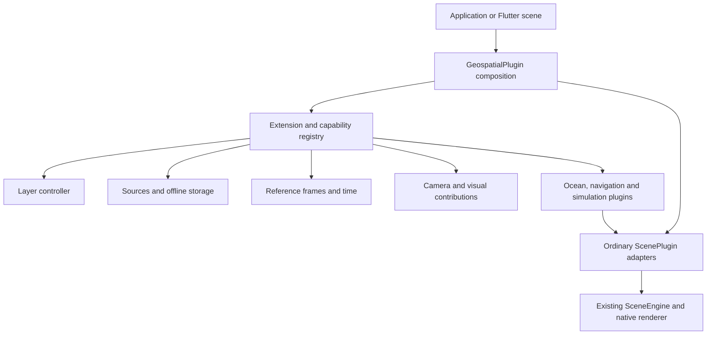

# Extensible geospatial worlds and layers

Date: 2026-10-03
Status: architecture and ocean-first sequence approved on 2026-10-03.
The implementation plans still require review. No runtime implementation is included.

## What you can build

You should be able to install geospatial once, add plugins to it, and build a
world from terrain, imagery, oceans, atmosphere, routes, vehicles and simulation
outputs. Applications choose their own UI. The package supplies layer management,
data access, lifecycle handling and the native rendering integration.

The requested scope includes extensible camera behaviour, rendering and colour,
durable caching, offline access, flight, space and other physical simulations,
plus navigation backed by real traffic. Each plugin can supply its own materials,
geometry, effects and interaction. A route, an ocean and an orbital trajectory
need different visual treatments.

The approved first delivery is the extension host, layers, offline data and an
ocean integration. Navigation, flight and space have independent delivery and
qualification requirements below. The ocean must include professional water
effects, native buoyancy, levels of detail and working quality controls. Its
implementation requirements are specified in [the ocean design](ocean-design.md),
using the [water reference audit](water-reference-audit.md).
An extension interface alone does not establish support for any of these domains.

Rendering remains native Metal, Vulkan or DX12. The core stays independent of
geospatial, Flutter, provider APIs and simulation domains.

## What exists today

These findings come from the checkout inspected on 2026-10-03. Concurrent renderer,
game, ML and Studio work is present. Implementation must recheck these interfaces.

| Existing code | Reuse and limitation |
| --- | --- |
| [ScenePlugin and PluginContext](../../../packages/zyren/lib/src/plugins/engine.dart) | Dependency ordering, typed scene services, GPU resources, frame hooks and frame demand. Each scene plugin gets its own context. |
| [AttachmentScope](../../../packages/zyren/lib/src/plugins/attachment_scope.dart) and [plugin updates](../../../packages/zyren/lib/src/plugins/plugin_updates.dart) | Cleanup and live reconciliation already exist. Failed reconciliation reports the remaining active plugins; it does not restore the entire previous graph. |
| [Shared PluginGraph](../../../packages/zyren/lib/src/plugins/plugin_graph.dart) | Named render contributions, dependencies and resource lifetime. Reuse its compilation path. |
| [GeospatialPlugin](../../../packages/zyren_geospatial/lib/src/geospatial_plugin.dart) | Currently provides the ellipsoid reference only. There is no geospatial extension or general layer registry here. |
| [TerrainPlugin](../../../packages/zyren_geospatial/lib/src/terrain/terrain_plugin.dart) and [TileScheduler](../../../packages/zyren_geospatial/lib/src/streaming/tile_scheduler.dart) | Existing streaming, bounded requests, parent coverage, cancellation and memory caching. Terrain currently has a fixed plugin ID. |
| [Geospatial exports](../../../packages/zyren_geospatial/lib/zyren_geospatial.dart) | Imagery composition, terrain overlays, controls, atmosphere and clouds exist. Imagery layers are not a general world layer system. |
| [LayerMask](../../../packages/zyren/lib/src/scene/layer_mask.dart) | A 32-bit render and query mask. Geographic layer IDs must not consume one bit each. |
| [AssetCache](../../../packages/zyren/lib/src/assets/asset_cache.dart) and [ByteSourceResolver](../../../packages/zyren/lib/src/assets/source_resolver.dart) | Shared decoded caching and bounded source reads. Neither is a persistent geographic download catalogue. |
| [FilePipelineCache](../../../packages/zyren_pipeline/lib/src/file_cache.dart) | Persistent, pinned model bundles with locking and atomic publication. Reuse for imported models through an adapter; its model bundle format is not a geographic tile index. |
| [AtmosphereLutCache](../../../packages/zyren_geospatial/lib/src/atmosphere/lut_cache.dart) | Device-scoped GPU table leases. Keep this separate from durable source data. |
| [Navigation](../../../packages/zyren_navigation/README.md) | Local navigation surfaces, obstacles and path following. Road directions, map matching and traffic are a separate domain. |
| [GameClock](../../../packages/zyren_game/lib/src/runtime/clock.dart) and [PhysicsPlugin](../../../packages/zyren_physics/lib/src/plugin.dart) | Fixed-step admission and externally driven native physics. Geospatial simulation must integrate with an existing clock when one owns the world. |
| [AtmospherePlugin](../../../packages/zyren_geospatial/lib/src/atmosphere/plugin.dart) and [PointOfView](../../../packages/zyren_geospatial/lib/src/point_of_view.dart) | ECEF and local-frame support already exist, but frame configuration is distributed across consumers. |

Existing procedural terrain runs without network access. Persistent regional
downloads and restart recovery are additional work.

## Architecture choice

Three approaches were considered:

| Approach | Consequence |
| --- | --- |
| Geospatial extension registry, compiled into ordinary scene plugins | Recommended. You get domain APIs and independent extension scopes while retaining the core engine's lifecycle and GPU ownership. |
| A nested engine inside GeospatialPlugin | Duplicates lifecycle, capability validation, frame scheduling and error handling. It also complicates composition with existing scene plugins. |
| Continue with unrelated scene plugins only | Preserves the current API but leaves layers, data policy and cross-plugin coordination to each application. |

An extension is an installed capability. A layer is content that capability owns.
One plugin can contribute several layers or no layers. Ocean sampling, route
queries and simulation can remain active when their visual layers are hidden.



### Public composition and ownership

Keep `GeospatialPlugin()` usable in existing scene plugin lists. Add an extension
descriptor API and a stable `scenePlugins` expansion that includes the host and
each extension's adapters. Callers install the expanded list once. The expansion
must retain adapter identity across Flutter rebuilds.

Composition validation must reject installing a configured host without its
declared adapters, or installing both a legacy plugin and its extension adapter.
The simple legacy `GeospatialPlugin()` registration remains valid. A configured
extension must never be silently ignored because the caller omitted expansion.

The following shows proposed API shape, not code available in the package:

```dart
final geospatial = GeospatialPlugin(
  extensions: [
    TerrainExtension(id: 'ground', source: elevationSource),
    OceanExtension(id: 'sea', coverage: oceanCoverage),
    GlobeCameraExtension(id: 'camera'),
  ],
);

// Use this list in the existing SceneEngine or SceneCanvas plugins argument.
final scenePlugins = [
  ...geospatial.scenePlugins,
  ...applicationPlugins,
];

// Once attached, applications can present their own controls.
geospatial.layers.setVisible('sea.surface', false);
```

`GeospatialExtension` declares a stable ID, contract version, required and
optional services, native features, contributed layer types, and owned adapters.
Adapter IDs are namespaced by extension ID. Dependencies resolve across the full
scene list, including plugins supplied by the application.

Each adapter receives its own `PluginContext`; a `GeospatialContext` wraps that
context with access to the host's typed registries. Never invoke several child
plugins using the host's context. Registration tokens belong to the adapter's
`AttachmentScope` and expire on detach, including partial attachment failures.

Only one geospatial host is allowed per scene in the initial contract. Multiple
viewports use separate scene contexts and may share immutable CPU data through
an explicitly supplied data store. GPU resources remain scoped to their device.
Multi-body simulations can contain many bodies without installing multiple hosts.

Live extension changes are prepared and validated outside engine callbacks. The
application reconciles the complete scene plugin list through the existing engine
or Flutter adapter. Invalid dependencies, duplicate IDs, unsupported features and
incompatible singleton providers fail before reconciliation starts. Attach failures
report the surviving plugin IDs and affected layer state. They do not promise
rollback that the current engine cannot provide.

Required dependencies control lifetime; optional services are queried by supported
contract version. Removing a required provider is rejected until its dependents
are included in the same removal. Optional-service loss produces an observable
capability change. Registry snapshots describe active attachments, including the
remaining graph after a failed update, not just the requested configuration.

## Built-in layers

`GeoLayerController` owns immutable snapshots and versioned changes. You can add,
remove, group, reorder, query and update layers without creating a widget. It also
provides bounds, attribution, feature selection, picking results and readiness.

A layer has a stable string ID, owner extension, optional parent, source revision,
supported operations, style revision and spatial/time coverage. Render masks remain
an optional filter inside a layer. They do not limit the number of layers to 32.

Layer kinds are registered identifiers. Built-in adapters cover elevation, raster
imagery and draped vectors. Optional adapters cover 3D Tiles, point clouds, volumes,
ocean surfaces, routes, trajectories and simulation entities. A new extension can
register a new kind and its typed configuration without editing a central enum.

The initial controller contract includes:

- Stable sibling ordering and atomic batch edits. Reject parent cycles, duplicate
  IDs and references to missing layers before publishing a new revision.
- Effective group visibility, queryability and opacity. An operation is advertised
  only if the layer renderer supports it; unsupported opacity or blending fails
  explicitly. Group opacity is multiplicative per child, not an isolated group
  composite unless that capability is provided.
- Separate loading, partial, ready, stale, failed and unavailable data states.
  Lifecycle is separate: registered, attaching, attached, suspended or detached.
  Hidden does not mean unloaded, and rendering disabled does not imply simulation
  paused. The host sets retention and execution policies independently.
- Bounds and distance/scale/time filtering, including polar coverage and regions
  crossing the antimeridian. Unknown coverage stays unknown.
- Cancellation, retry, refresh and source replacement with generations. A late
  completion cannot populate a removed layer or overwrite a newer source.
- Layer/feature IDs and geodetic hit positions in pick results. Query visibility
  is explicit, so applications can query hidden data deliberately.
- Serializable configuration with schema versions, stable source references and
  registered codecs. Loading validates the full document. Unknown extensions or
  schema versions remain unresolved with diagnostics; credentials and live
  resource handles are never serialized.

Order within an imagery stack controls composition. Order across 3D layers does
not override physical depth testing. Render-pass dependencies, transparency and
semantic layer order are distinct. The controller reports conflicts instead of
turning every layer into a screen overlay.

Visible coverage retains parent terrain until replacement is ready. First extend
the existing terrain and imagery adapters to accept instance identities and
controller revisions. Keep legacy IDs and standalone constructors working. When
overlapping elevation layers exist, the application selects the elevation provider
used for sampling; priority must not silently alter a simulation's ground model.

## Caching and offline access

Data access belongs to the built-in layer infrastructure and also serves plugins
without visible layers. Use a typed `GeoResourceRequest` and `GeoDataStore`, with
bounded source transport delegated to `ByteSourceResolver` and `AssetServices`.
Provide a native file-store implementation through a separate import in
`zyren_geospatial`; applications can supply another store.

Cache identity includes source ID and version, authorization partition, resource
address, projection/tiling scheme, time slice, format and decoder version. Derived
data also includes its style or algorithm revision. Signed URLs and credentials
are transport details, not public keys or persisted diagnostic labels. A resource
may be a tile, model, coastline mask, field, route graph or ephemeris asset.

Keep these resource budgets separate:

| Tier | Ownership and eviction |
| --- | --- |
| Encoded source bytes on disk | Persistent bounded store, checksums, atomic publication and access metadata. |
| Decoded CPU data | Reuse AssetCache or source-specific bounded caches with leases. Shared consumers do not duplicate decoding unnecessarily. |
| GPU resources | Native resource scopes, device generations and deferred retirement. Disk persistence never stores live GPU handles. |

Use source-versioned request coalescing and bounded download/decode/upload queues.
Cancellation releases a consumer immediately but keeps the physical work counted
until it settles. Global and per-source budgets prevent one layer from starving
the others. Cache admission, request scheduling and GPU allocation failures have
separate diagnostics.

Access policies are `onlineOnly`, `cacheFirst`, `networkFirst` and `offlineOnly`,
with explicit freshness and stale-data rules. `offlineOnly` cannot invoke a network
resolver, including for redirects or nested resources. Sources declare whether
caching and offline export are permitted; unknown permission does not authorize
a bulk download.

Stale fallback applies only to configured failure classes. Access denial or a
changed authorization partition cannot silently reuse previously authorized data.
Offline access uses an explicit host policy for retained protected resources.

An offline region is a versioned manifest of resources for selected layers,
geographic coverage, detail bounds and time intervals. Creation first estimates
bytes and dependencies. Downloads support progress, cancellation, resumable jobs,
integrity checks and pinning. Temporary bytes and publication overhead count
against disk admission; pinned regions are never silently evicted.

The store recovers interrupted writes and uses locks for concurrent processes.
Manifest publication occurs only after required resources verify. Missing terrain,
imagery, styles, glyphs, model textures or provider metadata produce incomplete
coverage with the missing dependencies listed. Test a cold process restart with
network access disabled, not only a warm cache hit.

Use `FilePipelineCache` through an optional adapter for imported model bundles.
Keep geographic region indexing in geospatial. Any shared storage primitive
extracted later must remain independent of model or geographic semantics.

Historical traffic can be retained only when the provider permits it and must
retain its observation time. Offline navigation requires a downloaded routing
graph and a local routing implementation. Saved route geometry alone supports
route display, not arbitrary offline route calculation or live traffic.

## World frames, time and simulation

The host provides a world reference service for geodetic, body-fixed and local
coordinates, with explicit units and height datum. ECEF positions use doubles;
rendered geometry retains local origins. Local physics uses bounded metre-scale
frames. Rebase events include transforms and revisions for cameras, velocities,
physics state, picking caches and temporal render history.

Height conversion is a provider capability. Ellipsoid height, terrain elevation
and mean sea level cannot be substituted silently. Earth is the default body;
additional bodies supply their ellipsoid, frame and gravity models explicitly.

Simulation time is independent of rendering frequency. Define `GeoSimulationClock`
as a driving contract, with an adapter to the existing game session when present.
Exactly one driver advances a simulation. You can pause, step, change time scale,
record inputs and replay from a checkpoint. Systems declare their step size,
catch-up limit, interpolation and replay support. Excess elapsed time is reported.

Analytic systems may evaluate an arbitrary time directly. Stateful solvers must
restore and replay, or reject seeking. Feeding them a negative delta is not a
rewind implementation. Determinism claims are scoped to a model version, inputs,
solver and qualified platform; live feeds must be recorded for replay.

Simulation extensions declare inputs and outputs with units, frame, time, spatial
coverage, source revision and quality. Contracts include terrain sampling, gravity,
atmospheric density, wind, water height/current and entity state. Sampling returns
available, stale, outside-coverage or failed results. Domain plugins determine
whether to pause or continue with an explicitly selected approximation.

Coupled systems use a declared dependency graph and deterministic tick phases:
sample external fields, evaluate forces/controls, integrate, resolve interactions,
publish state. Cyclic coupling requires a solver that owns that coupled step and
declares convergence limits. Plugin ordering alone is not a coupling solver.

Space adapters must carry an explicit reference frame, epoch, time scale and
ephemeris/model revision. SPICE documents distinct inertial/body-fixed frames
and time systems; these motivate explicit fields in our proposed contract.
See the primary [frame reference](https://naif.jpl.nasa.gov/pub/naif/toolkit_docs/C/req/frames.html)
and [time reference](https://naif.jpl.nasa.gov/pub/naif/toolkit_docs/C/req/time.html).
No SPICE dependency or propagator is selected by this design.

## Camera, rendering and bespoke visuals

Camera extensions provide a base rig, ordered pose modifiers and constraints.
One rig owns the camera pose for a view. Globe orbit, route following, cockpit,
chase, free flight and orbital tracking switch through an explicit controller.
Modifiers declare order and affected components, so two plugins cannot silently
overwrite the camera in unrelated frame callbacks. Input ownership and transitions
reuse existing core controls and interaction services.

Visual plugins contribute materials, geometry, lighting or render passes through
the existing public GPU APIs. They declare native feature requirements, depth
convention, colour space, alpha convention, inputs and output lifetime. The host
validates pass dependencies and exclusive ownership of final composition,
environment and temporal controls. Existing atmosphere/effect composition needs
an integration audit before additional water passes are admitted.

Separate material styling from final image processing. Routes can own ribbon
geometry, directional markers and traffic styling; an ocean owns water shading;
simulation entities can use imported meshes, trails and domain-specific overlays.
Global exposure and display conversion remain coordinated with core render
settings so contributions are not tone-mapped twice.

Quality profiles declare concrete resource limits, sampling settings and required
features. Lower quality must be selected explicitly or through an application
policy whose decision is observable. A missing native feature produces an
unsupported result. Each plugin supplies reference scenes at the relevant scales
and reports measured frame cost and resource use for the device tested.

## Optional domain plugins

Package names below are proposed ownership boundaries, not existing packages or
publication claims. Geospatial has no dependency on these optional domains.

| Plugin | Behaviour and required integrations | Completion evidence |
| --- | --- | --- |
| `zyren_geospatial_ocean` | Global ellipsoid surface with distant coverage and bounded local detail, coastline/bathymetry providers, spectral waves, native water shading, surface sampling, atmosphere and camera integration. Ship native buoyancy in an independently installable physics adapter. | Surface-to-orbit captures, poles/dateline, coastline tests, wave sampling agreement, buoyancy forces and torque, LOD/quality transitions, offline restart, frame/resource measurements and cleanup on qualified devices. |
| `zyren_geospatial_navigation` | Routing, map matching, directions, alternatives, traffic freshness, incidents and rerouting. Separate route/traffic visual layers and camera following. Optional local routing engine for downloaded graphs. | Provider fixtures plus authorized live routes, cancellation and stale-result races, denied/rate-limited requests, disconnect/recovery and offline graph queries. |
| `zyren_geospatial_flight` | Rigid-body flight, vehicle mass/inertia, aerodynamic coefficients, propulsion, controls, wind/density and terrain interaction, with cockpit/chase cameras. Reuse native physics for contact where appropriate. | Reference manoeuvres with stated tolerances, step convergence, replay, terrain contact, scale transitions and native visual examples. |
| `zyren_geospatial_space` | Versioned body/gravity/ephemeris models, orbital propagation, trajectories and manoeuvres, frame/time conversion and tracking cameras. Local physics only for applicable proximity/contact work. | Known orbit cases, conservation/error bounds, frame/time checks, discontinuities, large-distance rendering and recorded replay. |
| Additional physical simulations | Register their solver, field providers, units, validity limits and visual contributions. Weather, hydrology or environmental fields can use scientific and particle adapters. | Domain-specific validation; registering a plugin or drawing a field does not establish a validated solver. |

### Ocean acceptance boundary

The ocean must cover the globe independently of map imagery tiles. Use a global
ellipsoid representation for distant coverage and camera-relative surface detail
with continuous transitions near the water. The selected mesh and wave approach
must pass seam, horizon, pole and origin-rebase tests before being fixed as public
configuration.

Provide a bounded analytic wave model for reference and a spectral wave model for
the fidelity target. The latter needs a separate native compute design and numeric
checks. Both expose height, normal and surface velocity at the simulation time.
CPU queries and rendered displacement must agree within a declared tolerance;
asynchronous GPU sampling reports latency and cannot silently drive same-tick
buoyancy with old values.

The visual target includes reflected sky/sun, view-dependent reflectance,
absorption and transmission, depth-aware shore transitions, wave foam and an
underwater transition. Each effect needs an implemented native path and evidence.
Screen-space inputs must declare missing off-screen coverage. Wakes, interaction
foam and spray are required bounded effects in the ocean delivery. A fully coupled
coastal fluid solver and overturning breaking-wave geometry remain separate
simulation capabilities, identified as such.

Earth mode requires coast coverage with provenance and an explicit sea-level
datum. Existing terrain water masks can refine local coverage but are not a global
ocean dataset. Unknown coast coverage must be reported. An explicit all-water body
mode can render a water planet without land masks; it cannot be presented as an
accurate Earth coastline. Selecting distributable coastline/bathymetry assets is
still required for the Earth example.

### Navigation acceptance boundary

Keep `RoutingProvider`, `TrafficProvider`, `MapMatchingProvider` and
`PositionProvider` independently replaceable. Requests contain transport mode,
departure time, constraints, waypoints and cancellation. Results contain geometry,
maneuvers, durations, units, provider/graph revisions, coverage and observation
times. Cache partitioning and request generations prevent stale route replacement.

Traffic capability is more specific than a boolean. Report whether a result uses
current observations, historical estimates, a mixture or no traffic information.
For example, Mapbox documents a driving-traffic profile using current and historic
conditions with geographic coverage limits. That API is one possible adapter,
not a selected dependency. See its [Directions documentation](https://docs.mapbox.com/api/navigation/directions/).

A route line is only presentation. Navigation completion also requires progress,
off-route detection, rerouting, position accuracy handling and provider errors.
Global route sampling must handle the antimeridian and retain provider geometry.
All external provider credentials remain in the application-supplied transport.

## Delivery and qualification

Split the programme into independently reviewable implementations. The host and
layer contract come first because every requested domain uses them. Do not publish
empty ocean, navigation, flight or space packages to imply support.

| Delivery | Acceptance gate | Implementation now | Live verification now |
| --- | --- | --- | --- |
| Extension host and layers | Dependency/lifecycle tests, independent scopes, layer batches, migration of real terrain/imagery/atmosphere integrations, headless and Flutter usage examples. | Proposed | Not run |
| Offline data | File store, resource policy, restart recovery, region download/pinning, concurrent readers/writers, corruption and denied-resource handling. | Proposed | Not run |
| Camera/visual contracts and ocean | Actual native passes, sampling, Earth coverage data, integrated example, pause/hide/reload semantics and quality measurements. | Proposed | Not run |
| Navigation and traffic | Real provider adapter and native route presentation, then separately qualified offline routing. | Proposed | No provider selected |
| Simulation adapters, flight and space | One clock owner, frame/unit correctness, real solver models and documented numeric validity. | Proposed | Not run |

Pure Dart tests cover identity, ordering, lifecycle races, cache policies, layer
state and numerical cases. Integration tests exercise cancellation during removal,
failed attachment, source swaps, store restarts, auth partition changes and denied
reads. Invalid data must produce a typed failure without poisoning another layer.

Native checks cover atmosphere/ocean/effects composition, transparency and depth,
surface-to-orbit precision, camera movement, resize, resource retirement and device
loss where supported. Run the existing package boundary check and affected tests
with the workspace FVM SDK. Current workspace configuration must be read again
before implementation.

The example owns any compact controls and attribution display. Check desktop and
narrow native layouts, but do not make a layer sidebar a package dependency.
Register inspection through existing devtools and agent contracts where needed;
do not add a second diagnostics server.

Report CPU cache bytes, encoded disk bytes, GPU payload estimates, in-flight work
and measured native allocation separately. Unknown physical GPU residency stays
unknown. Record device, backend, resolution, quality, data/model revisions and
frame-time distribution with every visual performance claim.

## Approved decisions and remaining inputs

The approved choices are a headless host with built-in layers and data access,
optional domain packages, ordinary core scene-plugin lifecycles, and the ocean as
the first domain integration. Professional water, buoyancy, LOD and quality
controls are explicit requirements. Existing standalone APIs remain supported during
migration. An application can supply every visible control itself.

Provider selection, distributable Earth coast data and reference device/quality
targets remain explicit inputs to the domain specifications. This proposal does
not claim any new runtime capability, live traffic access, flight model accuracy
or native visual qualification.
