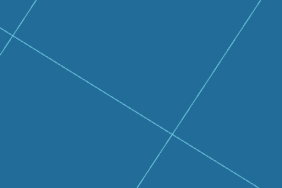
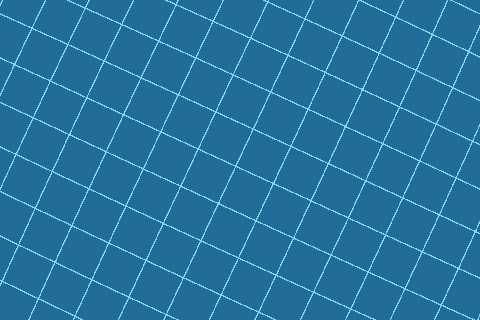
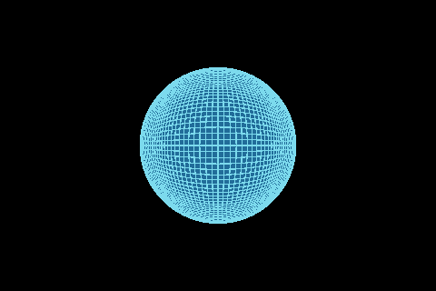

# Ocean surface evidence, 2026-10-03

W3 now supplies a complete ellipsoid mesh, bounded camera LOD, edge stitching,
native morph targets and fixed wave charts. You can render this geometry through
Zyren's public mesh and line APIs. These captures use an undistorted blue surface;
water displacement, optics and physical query inversion are later tasks.

## Checked

- All six cube faces, reversed edge coordinates, cube corners and mixed coarse/fine
  seams on WGS84 and a triaxial ellipsoid.
- Exact dyadic coverage rejects holes, overlap and unbounded patch input. LOD
  admission preserves a complete balanced cover and reports unmet detail targets.
- Fine edge vertices follow coarse triangle chords. Common-refinement geometry
  represents both transition endpoints, including coarsening and mixed changes.
  Tests check intermediate morph fractions and admission failure.
- Fixed world chart coordinates, deterministic seeds and smooth overlap derivatives
  agree with finite differences at seams and poles. Physics leases survive visual
  culling; over-budget residency changes leave the previous set intact.
- 29160 sampled patch points across WGS84 and two triaxial bodies fit conservative
  bounds and chart requests. Invalid numeric ranges and displacement bounds fail.
- Native macOS rendering completed 48 camera states, with extra morph snapshots at
  seven states, from 100 m to 20000 km altitude. Each nadir pixel remained covered.
  Native meshes use the core deformation path; debug lines use its expanded lines.

The route uses a deliberately tight 144-patch budget, 8 segments per patch and
480 x 320 output. Complete covers used 84..144 patches, at most 11664 vertices and
18468 transition vertices. Thirty-eight camera states exceeded the requested
4-pixel curvature target. The maximum reported estimate was about 1.01e8 pixels where
the camera lay inside a coarse bounding sphere, causing the distance denominator
to reach its 1 mm floor. That is an unmet estimate, not a measured image defect or a
claim that the requested quality passed.

The maximum projected discrepancy between shared edges reconstructed from the
Float32 mesh buffers was 0.0001592 physical pixels. This CPU inspection includes
morph deltas and camera projection; it does not measure every GPU raster edge.
Complete topology, numeric seams, native nadir coverage and saved image inspection
are separate checks. We inspected the saved captures and found a closed globe and
connected grid edges. Interactive app-window acceptance remains pending because
the Mac was locked during this run.

The first native route failed at orbital height with a fixed 10 cm near plane.
Altitude-aware clipping fixed the depth precision loss. The saved route uses a
near plane of `max(0.1 m, altitude * 0.01)` and a far plane beyond the whole body.
Debug grid lines receive a small outward offset to avoid coplanar depth fighting.

[Full route measurements](ocean-surface/route.json)





## Validation and remaining gates

`RUN_NATIVE_GPU=1` ocean package tests: 30 passed, no skips. Analyzer and package
boundary checks passed. Native evidence is macOS only. Android Vulkan, iOS Metal
and Windows DX12 have not run for W3.

Run from the repository root with FVM Dart 3.47.5:

```sh
RUN_NATIVE_GPU=1 OCEAN_CAPTURE_DIR=/tmp/ocean-surface \
  .fvm/flutter_sdk/bin/dart test packages/zyren_geospatial_ocean/test --concurrency=1
```

Wave charts currently provide coordinates, derivatives and residency admission.
The following query/controller tasks allocate their native fields and couple them
to displaced rendering. W3 rejects unsafe spatial bounds; W4 must still reject
choppy-wave folds or failed inverse queries. No AAA water or device performance
acceptance follows from this mesh test.
