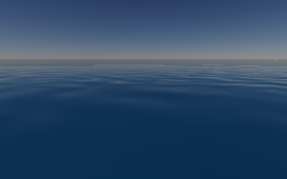
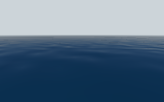

# Distance fog and ocean visibility

The optional `GeoDistanceFog` API shares an opaque distance limit between the
atmosphere and ocean. Planet offers Off, Light (1.5 to 6 km) and Dense (100 m to
1 km). The default is Off. Surface scenes expose the control; underwater-capable
scenes and the orbit route keep it disabled.

## Native checks

The macOS Metal check uses the saved calm scene at time zero, 320x200, custom
balanced detail, on the M3 Max. Dense fog reduces native scene draw submissions
from 192 to 24. The fog-aware LOD plan allocates 189 patches, of which 24 touch
the visible range. The same fogged scene with all 189 patches submitted produces
the exact same RGBA image: maximum channel difference is 0/255.

The test also checks the first frame, moves the camera before a periodic LOD
rebuild, compares physical water position with fog off, and verifies zero live
native allocations and graphs after disposal. Fog is published before the first
atmosphere frame, preventing an unfogged frame with already-culled water.




Native atmosphere checks cover both depth conventions, near/mid/far blending,
an empty background, cloud depth and premultiplied blending, resize and disabling.
The existing aerial, medium and cloud checks pass. Responsive controls pass at
1440x900, 390x844, 320x568 and 844x390 with normal and 200% text size, including
selecting Dense fog without changing the canvas bounds.

These are draw-count and correctness results, not sustained frame-rate results.
Fog does not remove wave computation, physics or resident patch resources. The
previous desktop/mobile performance gates remain open. This is a depth-based
distance fade; height fog, local volumes and volumetric shafts are outside this
change. Transparent materials without depth inherit the depth behind them.

## Reproduce

From `examples/planet`, use Flutter 3.47.5:

```sh
RUN_NATIVE_GPU=1 OCEAN_FOG_CAPTURE=/tmp/ocean-fog fvm dart test test/ocean_fog_test.dart --concurrency=1
fvm flutter test test/ocean_layout_test.dart
```

From `packages/zyren_geospatial`, run the native shader checks:

```sh
RUN_NATIVE_GPU=1 fvm dart test test/distance_fog_test.dart --concurrency=1
```
