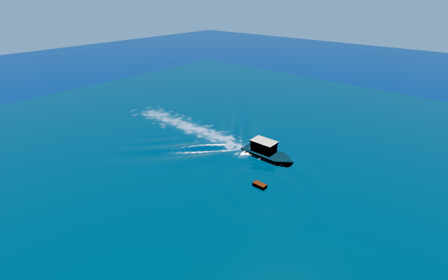
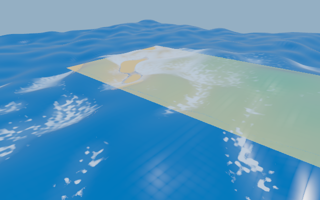
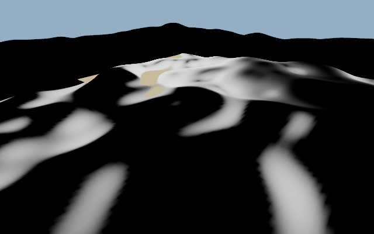

# Ocean interactions, macOS Metal

W10 ran with FVM Dart from Flutter 3.47.5 on the available macOS Metal backend.
The interaction/rendering suite passed 34 tests; the particle suite passed 22.
Package boundaries and the Apple ABI header check passed. These are offscreen
native runs. No manual native-window or user visual review is recorded.

The field uses a bounded native nine-point wave recurrence, absorbing boundaries,
independent foam history, stable publication and reusable graphs. The independent
scalar reference agrees within 2e-7 m in its 16-grid fixture. Tests cover rest,
symmetry, finite propagation, dissipation, exact integer-cell recentering, replay,
queue limits, failed-producer fencing and recovery. Foam emission, transport and
exponential decay agree with separate scalar expectations. One hundred field
create/step/close cycles return native live allocations to baseline.

Water displacement and normals use the same cubic field as the underwater
boundary. Native boundary distance agrees within 6 mm in the fixture. A new
interaction revision invalidates old captures. Whitecap emission reads the
filtered wave Jacobian; shore foam also requires positive covered depth. Missing
depth emits no shore foam. Field recentering clears the old source map and rejects
a stale producer until replacement.

Spray maps the same source/sequence/tick/generation into the particle scene's
world coordinates. It has separate source, event and particle caps. Exact native
particle positions, velocities and ages replay under one and three presentation
frames per simulation tick. Tests cover Earth-scale positions, wrong generations,
duplicates, zero-budget allocation, draining close and resource return.

The saved [four-second motion sequence](ocean-interactions/wake-motion.mp4) contains
40 frames at 640 by 400, 4x MSAA and ACES. The vessel follows prescribed motion at
3.5 m/s, supplies water-relative velocity to its wake events, and shares those
events with spray. A debris impulse occurs at two seconds. The 128², 40 m field
uses 1,052,768 logical bytes and two dispatches per tick; spray capacity is 1,024.
This readback capture run is not a frame-rate benchmark.

The coast is an owned synthetic depth grid. Its 128² spectral surface is held at
two seconds while emission history evolves for two seconds. This isolates foam
source and shading behavior; it is not a fully animated coast simulation. The
visible rectangular shelf and water footprint are qualification geometry.

The interaction field reports `visualOnly` and a null physical error bound.
Canonical buoyancy/query results do not include these ripples. Event energy is a
visual m² strength, not a rigid-body energy transfer. The local wave equation is
not a hull-flow, breaking-wave or Navier-Stokes solver. Grid dispersion remains;
cubic reconstruction improves highlight continuity but does not remove simulation
resolution limits. Foam breakup is procedural and spray uses caller-lit sprites.

W11 still owns effective quality transitions and aggregate admission. W12 still
owns the integrated lab, live-data/offline-world gate, device timing, Android,
iOS and Windows qualification, and professional visual acceptance. These captures
do not establish AAA parity or those remaining gates.
